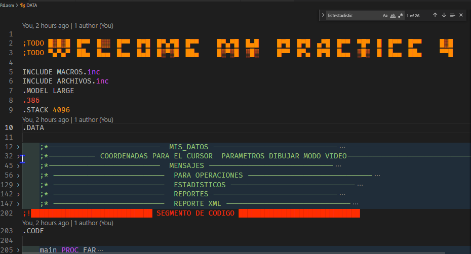
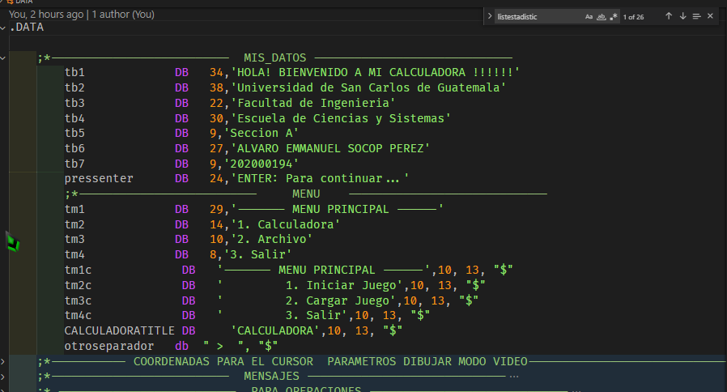
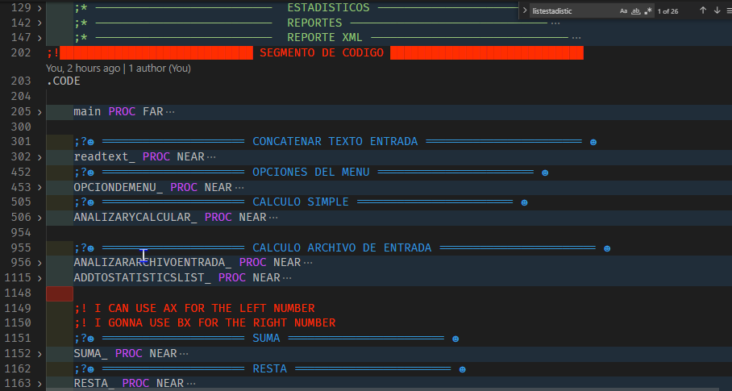
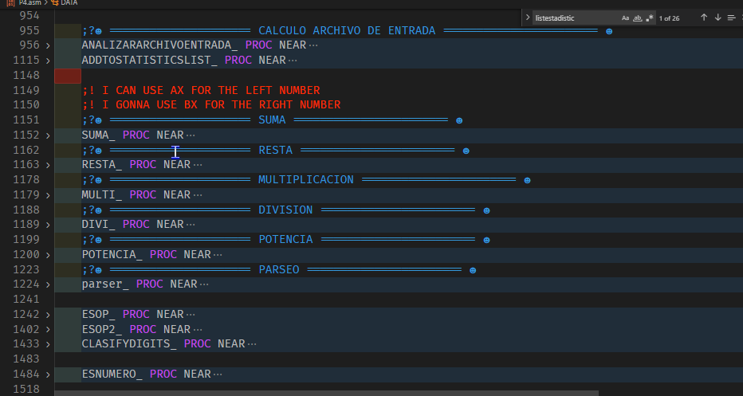
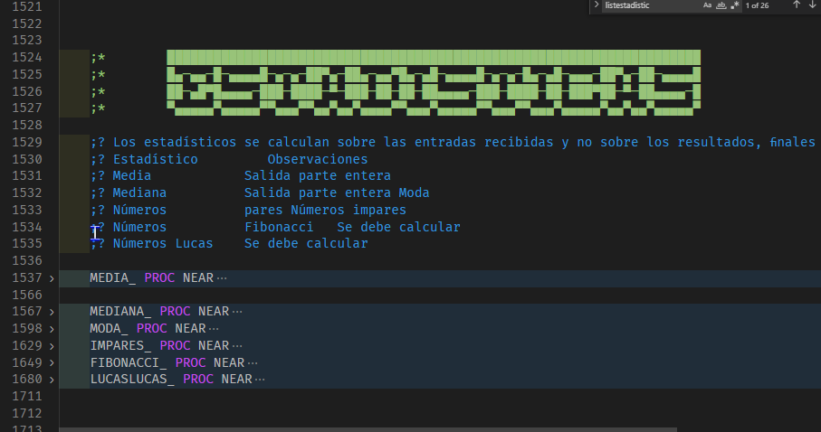
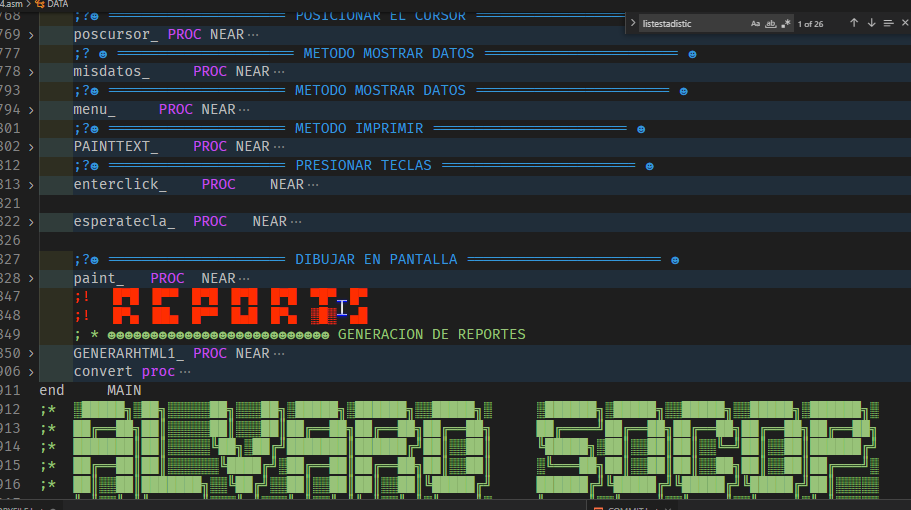
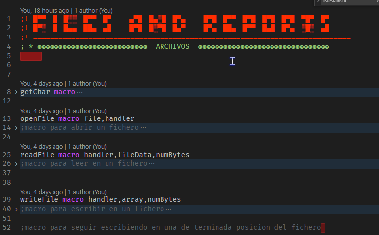
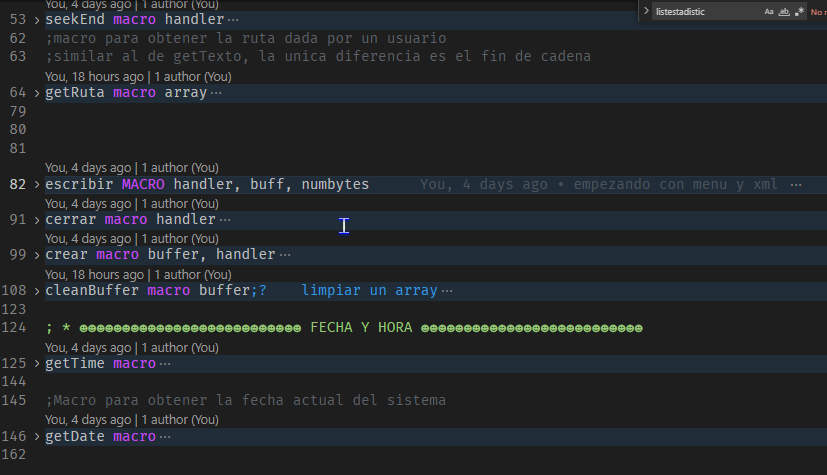

UNIVERSIDAD DE SAN CARLOS DE GUATEMALA

FACULTAD DE INGENIERIA

ESCUELA DE CIENCIAS Y SISTEMAS

LABORATORIO DE ARQUITECTURA DE COMPUTADORES Y ENSAMBLADORES 1

SEGUNDO SEMESTRE 2022

ING. OTTO RENE ESCOBAR LEIVA

TUTOR ACADEMICO SECCION A. OSCAR PERALTA

---

---

---

---

---

---

---

 <h1>PRACTICA #3</h1> 

 <h1>JUEGO BATTLESHIP</h1> 

---

---

---

---

| Nombre   |      Carnet      |  
|----------|:-------------:|
| Alvaro Emmanuel Socop Pérez | 202000194 | 

---

---

---

---

---

---

---

---

---

---

---

# MANUAL TECNICO
Programa desarrollado en Assembler que permite siendo su representación en consola el cual tiene 2 jugadores y tratan de
ganar en batalla de barcos ingresados, todos los reportes y estados en una página web; por último se tendrá toda la funcionalidad 
exclusivamente en consola.

>“El manual técnico es el que proporciona todas las pautas de configuración y la lógica con la que se ha desarrollado en el programa, con el objetivo de que cualquier programador entienda la idea propia y su estructura; por lo que se considera necesario ser documentada.”
## ÍNDICE

| Topico | Link |
| ------ | ------ |
| Introducción | [Ir](#intro) |
| Objetivos y alcances del sistema | [Ir](#ob) |
| Especificaciones Técnicas | [Ir](#specs) |
| Requisitos de Hardware | [Ir](#req) |
| Requisitos de software | [Ir](#req2) |
| Sistema operativo | [Ir](#sisop) |
| Lenguaje de Programación e IDE | [Ir](#lengprog) |
| Tecnologías utilizadas (Lógica del programa) | [Ir](#tech) |
| Funciones utilizadas   | [Ir](#func) |
| Flujo del programa | [Ir](#flujo) |
| Conclusiones | [Ir](#Conclu) |

## INTRODUCCIÓN
El presente manual técnico tiene como finalidad describir la estructura y diseño del programa analizador de escritorio de un archivo lfp, así como dar explicación de los métodos, clases y procesos de cada apartado del programa y la modificación que se le podría dar para cualquier finalidad como el de mejorar el sistema o cambiar algunos atributos propios del analizador. El sistema cuenta con implementación de varias librerías propias de python como re, ios, pathlab, entre otros, como parte del conocimiento adquirido en los laboratorios de programación de computadoras en base a ello trataré de explicar en que métodos se fueron utilizando y como hacen funcionar el programa en los distintos sistemas operativos.
La implementación de librerías externas a python también fueron una opción para poder pedir y abrir ventanas para elegir los archivos necesarios, también se explicará paso a paso cual es el camino para entender perfectamente la arquitectura del programa. Resulta ser bastante fácil de implementar los ciclos y condiciones, también los métodos de interfaces gráficas puesto que es una función que viene integrada con la paquetería por defecto de Tkinter de python y así solo instanciarlos importando las librerías y utilizarlas.  

## Objetivos y alcances del sistema

### Objetivo General
- Que el estudiante aplique los conocimientos adquiridos en el curso sobre el lenguaje ensamblador

### Objetivos Específicos
- Aplicar el conocimiento de operaciones básicas a nivel ensamblador.
- Conocer el funcionamiento de las interrupciones.
- Comprender el uso de la memoria en los programas escritos en ensamblador.
- Aplicar el manejo de archivos a bajo nivel.
- Comprender el uso de registros bandera.

## Especificaciones Técnicas

### Requisitos de Hardware
|  |  |
| ------ | ------ |
|Memoria mínima|	512 MB|
|Memoria recomendada |	1 GB|
|Espacio en disco mínimo|	250 MB de espacio libre  |
|Espacio en disco recomendado	|  500 MB de espacio libre|
|MVP	|Visual Studio Code y MASM instalados |

### Requisitos de software
## Sistema operativo 
Windows
•	Windows 10 (8u51 y superiors)
•	Tener instalado el programa de Proteus y Librerias de Arduino Code u otro editor
•	RAM: 128 MB
•	Espacio en disco: 124 MB 
•	Procesador: Mínimo Pentium 2 a 266 MHz 
•	Algún explorador de internet
Mac OS X 
•	Tener instalado el programa Proteus Code u otro editor
•	Explorador de 64 bits 
•	Se requiere un explorador de 64 bits (Safari, Firefox, por ejemplo) para ejecutar Oracle Java en Mac OS X.
Linux
•	Oracle Linux 5.5+1 
•	Oracle Linux 6.x (32 bits), 6.x (64 bits)2 
•	Exploradores: Firefox
•	Arduino
•	Proteus

## Lenguaje de Programación e IDE
Para el desarrollo del programa se utilizó el lenguaje de Programación C y el IDE Arduino y Visual Studio Code para el desarrollo de interfaz se utilizo Proteus 8.10

## Tecnologías utilizadas (Lógica del programa)
- Assembler es tipo de programa informático que se encarga de traducir un fichero fuente escrito en un lenguaje ensamblador, a un fichero objeto que contiene código máquina, ejecutable directamente por el microprocesador.

- MASM es El Microsoft Macro Assembler (MASM) es un ensamblador para la familia x86 de microprocesadores. Fue producido originalmente por Microsoft para el trabajo de desarrollo en su sistema operativo MS-DOS, y fue durante cierto tiempo el ensamblador más popular disponible para ese sistema operativo. 

## Funciones utilizadas 

## Flujo del programa
Tengo pantalla de bienvenida 

Luego muestro la pantalla de obtener las coordenadas de ambos jugadores

## Conclusiones

- Como conclusión podemos decir que el lenguaje ensamblador es mas que un tipo de lenguaje de bajo nivel en el cual es empleado para crear programas informáticos.

- •La importancia de este es que en el se pueden hacer cualquier tipo de programas que en otros lenguajes de alto nivel no, al igual que ocupan menos espacio en la memoria.

- Este lenguaje es creado a base de instrucciones para intentar sustituir al lenguaje maquina por uno similar utilizado por el hombre.

## Apéndice

;todo     █░█░█ █▀▀ █░░ █▀▀ █▀█ █▀▄▀█ █▀▀   █▀▄▀█ █▄█   █▀▀ ▄▀█ █▀▄▀█ █▀▀
;todo     ▀▄▀▄▀ ██▄ █▄▄ █▄▄ █▄█ █░▀░█ ██▄   █░▀░█ ░█░   █▄█ █▀█ █░▀░█ ██▄
;todo ---------------------------------------------------------------------------------------------------
.MODEL LARGE
.386
.STACK 64
.DATA
;*--------------------------  MIS_DATOS -----------------------------
tb1             DB   38,'BIENVENIDO AL JUEGO BATTLESHIPS !!!!!!'
tb2             DB   38,'Universidad de San Carlos de Guatemala'
tb3             DB   22,'Facultad de Ingenieria'
tb4             DB   30,'Escuela de Ciencias y Sistemas'
tb5             DB   9,'Seccion A'
tb6             DB   27,'ALVARO EMMANUEL SOCOP PEREZ'
tb7             DB   9,'202000194'
pressenter      DB   24,'ENTER: Para continuar...'

;*--------------------------     MENU    -----------------------------
tm1             DB   29,'------- MENU PRINCIPAL ------'
tm2             DB   16,'1. Iniciar Juego'
tm3             DB   15,'2. Cargar Juego'
tm4             DB   8,'3. Salir'
keypress          DB ?
keypresstempY          DB ?
keypresstempX          DB ?
tm1c             DB   '------- MENU PRINCIPAL ------',10, 13, "$"
tm2c             DB   '         1. Iniciar Juego',10, 13, "$"
tm3c             DB   '         2. Cargar Juego',10, 13, "$"
tm4c             DB   '         3. Salir',10, 13, "$"
;*--------------------------  COLORES -----------------------------
BLACK               EQU  00H

;*-------------------------- COORDENADAS --------------------------
POSX            DB  ?
POSY            DB  ?

;*--------------------------  PARAMETROS DIBUJAR -----------------------------
X1              DW  ?
X2              DW  ?
Y1              DW  ?
Y2              DW  ?
;*--------------------------  DRAWING THE TABLES -----------------------------
ship          DB "[",254,"] ", "$";██
shoot          DB "[X] ", "$"
dshoot          DB "[O] ", "$"
noship          DB "[ ] ", "$"
saltolinea      DB " ",10, 13, "$"

;* --------------------------  JUGADOR -----------------------------
iniciaunotext db "---EL JUGADOR 1 INICIA LA PARTIDA---", 10, 13, "$"
iniciadostext db "---EL JUGADOR 2 INICIA LA PARTIDA---", 10, 13, "$"
titleturno1 db "---      TURNO DEL JUGADOR 1     ---", 10, 13, "$"
titleturno2 db "---      TURNO DEL JUGADOR 2     ---", 10, 13, "$"
titlegano1 db "--- EL JUGADOR 1 GANO LA PARTIDA ---", 10, 13, "$"
titlegano2 db "--- EL JUGADOR 2 GANO LA PARTIDA ---", 10, 13, "$"

textiniciandojuego db "--- INICIANDO JUEGO ---", "$"
jugandojugador2 db "JUGANDO: JUGADOR 2", 10, 13, "$"
jugandojugador1 db "JUGANDO: JUGADOR 1", 10, 13, "$"
titledisparos db "DISPAROS", "$"
titlebarcos db "BARCOS", "$"
titleingresebarcos db "INGRESO DE BARCOS", "$"
titleingresodecoordenadas db "INGRESO DE COORDENADAS", "$"
titlebarcosdisponibles db "*** BARCOS DISPONIBLES ***", "$"
titleseleccionebarco db "Seleccione barco a posicionar", "$"
textbarcosvivos db "BARCOS VIVOS", "$"
textjugador1 db "Jugador 1=", "$"
textjugador2 db "Jugador 2=", "$"
textyasedisparoalli db "YA SE DISPARO ALLI", "$"
textenterparaturnosiguiente db "ENTER PARA TURNO SIGUIENTE", "$"
textsegurodeingresar db "ENTER PARA TURNO SIGUIENTE", "$"
textjuegobattleships db "JUEGO BATTLESHIPS", "$"
textconfirmaeldisparo db "Confirma el disparo? y/n", "$"
letx db ?

;*  ---------------------------------- BARCOS --------------------------
textoBoteneumatico          db "1. Bote Neumatico", "$"
textoDestructoramericano    db "2. Destructor Americano", "$"
textoDestructorjapones      db "3. Destructor Japones", "$"
textoAcorazado              db "4. Acorazado", "$"
textoPortaviones            db "5. Portaviones", "$"
limpiarbarcos               db "                     ","$"
decorotexto1                db 219,219,219,219,219,219,219,219,219,219,219,219,219,219,219,219,219,219,219,219,219,219,219,219,219,219,219,219,219,219,219,219,219,219,219,219,"$"
dt2                         db 219
borrarlinea             DB "                                        ",13
textvertical            db "1-Vertical", "$"
texthorizontal          db "2-Horizontal", "$"
textekisigual           db "X=", "$"
textyeigual             db "Y=", "$"
ereigual                db "R=", "$"
textuno                 DB "1","$"
textdos                 DB "2","$"
texttres                DB "3","$"
textcuatro              DB "4","$"
textcinco               DB "5","$"
textyahaybarcoalli               DB "YA HAY BARCO ALLI","$"
CINCO               DB "5","$"
CUATRO               DB "4","$"
TRES               DB "3","$"
DOS               DB "2","$"
UNO               DB "1","$"
CERO               DB "0","$"

BARCOSELECCIONADO       DB ?
POSXBARCOSELECCIONADO   DB ?
NUMTEMP   DB ?
POSYBARCOSELECCIONADO   DB ?
ROTACIONBARCOSELECCIONADO   DB ?            ;! 1 vertical    2 horizontal

NUMBARCOS1   Dw ?
NUMBARCOS2   Dw ?
FLAGPUEDOPONERBARCO     DB "1"
FLAGYA     DB "0"
; ! COORDENADAS DE LOS BARCOS QUE ESTAN EN EL TABLERO
arraybarco1x DB 8 dup("0")
arraybarco1y DB 8 dup("0")
arraybarco2x DB 8 dup("0")
arraybarco2y DB 8 dup("0")
arraybarco3x DB 8 dup("0")
arraybarco3y DB 8 dup("0")
arraybarco4x DB 8 dup("0")
arraybarco4y DB 8 dup("0")
arraybarco5x DB 8 dup("0")
arraybarco5y DB 8 dup("0")

arraybarco1x2 DB 8 dup("0")
arraybarco1y2 DB 8 dup("0")
arraybarco2x2 DB 8 dup("0")
arraybarco2y2 DB 8 dup("0")
arraybarco3x2 DB 8 dup("0")
arraybarco3y2 DB 8 dup("0")
arraybarco4x2 DB 8 dup("0")
arraybarco4y2 DB 8 dup("0")
arraybarco5x2 DB 8 dup("0")
arraybarco5y2 DB 8 dup("0")
temp1    DB "0"
temp2    DB "0"
;* --------------------------  MATRICES DE LOS JUGADORES -----------------------------
matriz1 DB 100 dup("0")  ;! PUEDE TENER  0   X   O
matriz2 DB 100 dup('0')  ;! PUEDE TENER  0   X   O
INDEX         Dw ?
INDEXtemp                Dw ?
INDEXCAMBIAR                Dw ?
;* --------------------------  DISPAROS -----------------------------
shootjug1x      DB ?
shootjug1y      DB ?
shootjug2x      DB ?
shootjug2y      DB ?
;* --------------------------  MATRICES DE LOS BARCOS -----------------------------
barcos1 DB 100 dup("0") ;! PUEDE TENER 0   1
barcos2 DB 100 dup('0') ;! PUEDE TENER 0   1
INDEXBARCOS         Dw ?
INDEXtempBARCOS                Dw ?

;* --------------------------  ERRORES TEXTS -----------------------------
NUMERONOVALIDO            db "Posicion mala", "$"

;* --------------------------  REPORTES -----------------------------
Filenamejug1  db  "ESTADO_JUEGO_JUG1.htm", 0
Filenamejug2  db  "ESTADO_JUEGO_JUG1.htm", 0
texthtml        DB "DIV"
;* --------------------------  MIS_DATOS -----------------------------
;* --------------------------  MIS_DATOS -----------------------------
temp DW  ?
KEY_PRESSED                     DB  ?

;!████████████████████████████ SEGMENTO DE CODIGO ████████████████████████████
.CODE
;!                ░█▀▄▀█ ─█▀▀█ ░█▀▀█ ░█▀▀█ ░█▀▀▀█ ░█▀▀▀█ 
;!                ░█░█░█ ░█▄▄█ ░█─── ░█▄▄▀ ░█──░█ ─▀▀▀▄▄ 
;!                ░█──░█ ░█─░█ ░█▄▄█ ░█─░█ ░█▄▄▄█ ░█▄▄▄█
    PAINTTEXT MACRO MYMESSAGE , LOCATION,COLOR                            ;? ▬▬▬▬▬ IMPRIMIR
        PUSHA
        MOV DX,LOCATION
        MOV BP, OFFSET MYMESSAGE
        MOV SI, COLOR
        CALL  PAINTTEXT_
        POPA
    ENDM PAINTTEXT

    misdatos MACRO                                                     ;? ▬▬▬▬▬ DATOS
        PUSHA
        CALL misdatos_
        POPA
    ENDM misdatos

    ;*========================= VIDEO ===================================
    esperatecla MACRO
        PUSHA
        CALL esperatecla_
        POPA
    ENDM  esperatecla

    paint	MACRO	CORNER1X, CORNER1Y, CORNER2X, CORNER2Y, COLOR ;? ▬▬▬▬▬ MENU DIBUJAR EN PANTALLA 
        PUSHA
        PUSH AX
        MOV AX, CORNER1X
        MOV X1, AX
        MOV AX, CORNER1Y
        MOV Y1, AX
        MOV AX, CORNER2X
        MOV X2, AX
        MOV AX, CORNER2Y
        MOV Y2, AX
        POP AX
        MOV AL, COLOR
        CALL paint_
        POPA
    ENDM	paint
    esperaenter MACRO                                                  ;? ▬▬▬▬▬ ENTER
        PUSHA
        mov ax, 00
        mov ah, 01h
        int 21h
        POPA
    ENDM esperaenter

    enterclick MACRO                                                  ;? ▬▬▬ ENTER
        PUSHA
        CALL enterclick_
        POPA
    ENDM enterclick

    ;*========================= MENU PRINCIPAL ===================================
    menu MACRO                                                     ;? ▬▬▬▬▬ MENU
        PUSHA
        CALL menu_
        POPA
    ENDM menu

    ;* ========================= CONSOLA ===================================
    limpiar MACRO                                                     ;? ▬▬▬▬▬ LIMPIAR
        mov ah, 00h
        mov al, 03h
        int 10h
    ENDM limpiar
    MOSTRARVAC MACRO  
        PUSHA                                                   ;? ▬▬▬▬▬ LIMPIAR
        CALL MOSTRARVAC_
        POPA
    ENDM MOSTRARVAC
    MOSTRARVAC2 MACRO  
        PUSHA                                                   ;? ▬▬▬▬▬ LIMPIAR
        CALL MOSTRARVAC2_
        POPA
    ENDM MOSTRARVAC2

    readtext MACRO                                            ;? ▬▬▬▬▬ LEER DE CONSOLA
        ; PUSHA
        CALL readtext_
        ; POPA
    ENDM readtext
    ACTUALIZARPUNTEO2 MACRO                                            ;? ▬▬▬▬▬ LEER DE CONSOLA
        PUSHA
        CALL ACTUALIZARPUNTEO2_
        POPA
    ENDM ACTUALIZARPUNTEO2

    print macro texto
        mov ah, 09
        mov dx, offset texto
        int 21h
    ENDM print
    println macro texto
        mov ah, 09
        mov dx, offset texto
        int 21h
        print saltolinea
    ENDM println

                    ;! ▀▀▀▀▀▀▀▀▀▀   ▜▛ ▞▚ ▙ ▙▄ █☰ 🆁 ██ ▟▛ ▀▀▀▀▀▀▀▀▀▀▀▀▀▀
    PAINTTABLEROSHOOTS1 MACRO
        PUSHA
        CALL PAINTTABLEROSHOOTS1_
        POPA
    ENDM PAINTTABLEROSHOOTS1
    PAINTTABLEROBARCOS1 MACRO
        PUSHA
        CALL PAINTTABLEROBARCOS1_
        POPA
    ENDM PAINTTABLEROBARCOS1

    PAINTTABLEROSHOOTS2 MACRO
        PUSHA
        CALL PAINTTABLEROSHOOTS2_
        POPA
    ENDM PAINTTABLEROSHOOTS2
    PAINTTABLEROBARCOS2 MACRO
        PUSHA
        CALL PAINTTABLEROBARCOS2_
        POPA
    ENDM PAINTTABLEROBARCOS2

    ; * ---------------------IMPRIMIR TIROS JUG 1-----------------------
    PRINTSHOOTS1 MACRO
        STARTING:
            CMP matriz1[si], "X"
            JNE NOHAYTIRO
            JE SIHAYTIRO
        NOHAYTIRO:
            CMP matriz1[si], "O"
            JNE NOHATIRADO
            JE TIROPERONODIO
        TIROPERONODIO:
            print dshoot
            JMP SALIR
        NOHATIRADO:
            print noship
            JMP SALIR
        SIHAYTIRO:
            print shoot
            JMP SALIR
        SALIR:
    ENDM PRINTSHOOTS1

    ; * --------------------- IMPRIMIR BARCOS JUG 1---------------------
    PRINTSHIPS1 MACRO
        
        STARTING:
            CMP barcos1[si], "1"
            JNE NOHAYCUADRO
            JE printlleno
        NOHAYCUADRO:
            CMP barcos1[si], "X"
            JNE printvacio
            JE PEGOBARCO
        PEGOBARCO:
            print shoot
            JMP SALIR
        printvacio:
            print noship
            JMP SALIR
        printlleno:
            print ship
            JMP SALIR
        SALIR:
    ENDM PRINTSHIPS1

    ; * ---------------------IMPRIMIR TIROS JUG 2-----------------------
    PRINTSHOOTS2 MACRO
        STARTING:
            CMP matriz2[si], "X"
            JNE NOHAYTIRO
            JE SIHAYTIRO
        NOHAYTIRO:
            CMP matriz2[si], "O"
            JNE NOHATIRADO
            JE TIROPERONODIO
        TIROPERONODIO:
            print dshoot
            JMP SALIR
        NOHATIRADO:
            print noship
            JMP SALIR
        SIHAYTIRO:
            print shoot
            JMP SALIR
        SALIR:
    ENDM PRINTSHOOTS2

    ; * --------------------- IMPRIMIR BARCOS JUG 2---------------------
    PRINTSHIPS2 MACRO
        
        STARTING:
            CMP barcos2[si], "1"
            JNE NOHAYCUADRO
            JE printlleno
        NOHAYCUADRO:
            CMP barcos2[si], "X"
            JNE printvacio
            JE PEGOBARCO
        PEGOBARCO:
            print shoot
            JMP SALIR
        printvacio:
            print noship
            JMP SALIR
        printlleno:
            print ship
            JMP SALIR
        SALIR:
    ENDM PRINTSHIPS2

    VALIDARESPACIO MACRO
        PUSHA
        CALL VALIDARESPACIO_
        POPA
    ENDM VALIDARESPACIO
    VALIDARESPACIO2 MACRO
        PUSHA
        CALL VALIDARESPACIO2_
        POPA
    ENDM VALIDARESPACIO2
    ; * --------------------- POSICIONAR BARCOS JUGADOR 1---------------------
    COLOCARBARCO1 MACRO
        PUSHA
        CALL COLOCARBARCO1_
        POPA
    ENDM COLOCARBARCO1
    COLOCARBARCO2 MACRO
        PUSHA
        CALL COLOCARBARCO2_
        POPA
    ENDM COLOCARBARCO2
    COLOCARBARCO3 MACRO
        PUSHA
        CALL COLOCARBARCO3_
        POPA
    ENDM COLOCARBARCO3
    COLOCARBARCO4 MACRO
        PUSHA
        CALL COLOCARBARCO4_
        POPA
    ENDM COLOCARBARCO4
    COLOCARBARCO5 MACRO
        PUSHA
        CALL COLOCARBARCO5_
        POPA
    ENDM COLOCARBARCO5
    
     ; * --------------------- POSICIONAR BARCOS JUGADOR 1---------------------
    COLOCARBARCO1JUG2 MACRO
        PUSHA
        CALL COLOCARBARCO1JUG2_
        POPA
    ENDM COLOCARBARCO1JUG2
    COLOCARBARCO2JUG2 MACRO
        PUSHA
        CALL COLOCARBARCO2JUG2_
        POPA
    ENDM COLOCARBARCO2JUG2
    COLOCARBARCO3JUG2 MACRO
        PUSHA
        CALL COLOCARBARCO3JUG2_
        POPA
    ENDM COLOCARBARCO3JUG2
    COLOCARBARCO4JUG2 MACRO
        PUSHA
        CALL COLOCARBARCO4JUG2_
        POPA
    ENDM COLOCARBARCO4JUG2
    COLOCARBARCO5JUG2 MACRO
        PUSHA
        CALL COLOCARBARCO5JUG2_
        POPA
    ENDM COLOCARBARCO5JUG2

                    ;! ▀▀▀▀▀▀▀▀▀▀  MENU  ▀▀▀▀▀▀▀▀▀▀▀▀▀▀
    OPCIONDEMENU MACRO
        PUSHA
        CALL OPCIONDEMENU_
        POPA
    ENDM OPCIONDEMENU

    INICIODEJUEGOM MACRO
        PUSHA
        CALL INICIODEJUEGOM_
        POPA
    ENDM INICIODEJUEGOM

    CARGADEJUEGOM MACRO
        PUSHA
        CALL CARGADEJUEGOM_
        POPA
    ENDM CARGADEJUEGOM
    ; POSICIONAR CURSOR
    poscursor MACRO POSXTEMP, POSYTEMP
        ; PUSHA
        MOV AL, POSXTEMP
        MOV POSX, AL
        MOV AL, POSYTEMP
        MOV POSY, AL
        CALL poscursor_
        ; POPA
    ENDM poscursor

    ; decorobarra MACRO
    ;     CALL decorobarra_
    ; ENDM decorobarra
    ; decorobarra2 MACRO
    ;     CALL decorobarra2_
    ; ENDM decorobarra2

    recorrerm1 MACRO
        PUSHA
        CALL recorrerm1_
        POPA
    ENDM recorrerm1
    recorrerbarcos1 MACRO
        PUSHA
        CALL recorrerbarcos1_
        POPA
    ENDM recorrerbarcos1
    recorrerm2 MACRO
        PUSHA
        CALL recorrerm2_
        POPA
    ENDM recorrerm2

                    ;! ▀▀▀▀▀▀▀▀▀▀  DISPAROS  ▀▀▀▀▀▀▀▀▀▀▀▀▀▀
    DISPARAR MACRO
        PUSHA
        CALL DISPARAR_
        POPA
    ENDM DISPARAR

    shoot1 MACRO POSXTEMP, POSYTEMP
        PUSHA
        MOV AL, POSXTEMP
        MOV shootjug1x, AL
        MOV AL, POSYTEMP
        MOV shootjug1y, AL
        CALL shoot1_
        POPA
    ENDM shoot1
    ACTUALIZARPUNTEO MACRO
        PUSHA
        CALL ACTUALIZARPUNTEO_
        POPA
    ENDM ACTUALIZARPUNTEO

    shoot2 MACRO  POSXTEMP2, POSYTEMP2
        ; PUSHA
        MOV AL, POSXTEMP2
        MOV shootjug2x, AL
        MOV AL, POSYTEMP2
        MOV shootjug2y, AL
        CALL shoot2_
        ; POPA
    ENDM shoot2

    pasarreadtextanumeroY MACRO
        PUSHA
        CALL pasarreadtextanumeroY_
        POPA
    ENDM pasarreadtextanumeroY

    pasarreadtextanumeroX MACRO
        PUSHA
        CALL pasarreadtextanumeroX_
        POPA
    ENDM pasarreadtextanumeroX
    pasarreadtextanumeroBARCOY MACRO
        PUSHA
        CALL pasarreadtextanumeroBARCOY_
        POPA
    ENDM pasarreadtextanumeroBARCOY

    pasarreadtextanumeroBARCOX MACRO
        PUSHA
        CALL pasarreadtextanumeroBARCOX_
        POPA
    ENDM pasarreadtextanumeroBARCOX

    BARCOQUEELIGIO MACRO
        PUSHA
        CALL BARCOQUEELIGIO_
        POPA
    ENDM BARCOQUEELIGIO

    BARCOQUEELIGIO2 MACRO
        PUSHA
        CALL BARCOQUEELIGIO2_
        POPA
    ENDM BARCOQUEELIGIO2
    VALIDARSHOOT MACRO
        PUSHA
        CALL VALIDARSHOOT_
        POPA
    ENDM VALIDARSHOOT
    VALIDARSHOOT2 MACRO
        PUSHA
        CALL VALIDARSHOOT2_
        POPA
    ENDM VALIDARSHOOT2
    buscarbarco1 MACRO
        PUSHA
        CALL buscarbarco1_
        POPA
    ENDM buscarbarco1
    buscarbarco2 MACRO
        PUSHA
        CALL buscarbarco2_
        POPA
    ENDM buscarbarco2
    llenararrays3 MACRO
        PUSHA
        CALL llenararrays3_
        POPA
    ENDM llenararrays3
                 ;! ▀▀▀▀▀▀▀▀▀▀  REPORTES  ▀▀▀▀▀▀▀▀▀▀▀▀▀▀
    WriteHTM MACRO handler, buff, numbytes
        MOV ah, 40h
        MOV bx, handler
        MOV cx, numbytes
        lea dx, buff
        int 21h
    ENDM WriteHTM
    ; * ☻☻☻☻☻☻☻☻☻☻☻☻☻☻☻☻☻☻☻☻☻☻☻☻☻☻ VISTA DE ENTRADA BARCOS ☻☻☻☻☻☻☻☻☻☻☻☻☻☻☻☻☻☻☻☻☻☻☻☻☻☻☻☻☻☻☻
    PRINTVIEWSHIPS MACRO
        poscursor 1, 49
        print titlebarcosdisponibles
        poscursor 13,44
        print titleseleccionebarco
        ;* texto decoracion
        poscursor 0,43
        print decorotexto1
        poscursor 10,43
        print decorotexto1
        poscursor 24,43
        print decorotexto1
        ; decorobarra
        ; decorobarra2
        ; ? *********  imprimo barcos disponibles
        poscursor 3,50                  ;* BARCO 1
        print textoBoteneumatico
        poscursor 4,50                  ;* BARCO 2
        print textoDestructoramericano
        poscursor 5,50                  ;* BARCO 3
        print textoDestructorjapones
        poscursor 6,50                  ;* BARCO 4
        print textoAcorazado
        poscursor 7,50                  ;* BARCO 5
        print textoPortaviones

        poscursor 12, 49
        print titleingresebarcos
        poscursor 15, 63                ;* posiciono textos
        print textvertical
        poscursor 16, 63
        print texthorizontal
        
        poscursor 18, 50                ;* IMPRIMO COORDENADAS XY
        print textuno
        poscursor 18, 55
        print textdos
        poscursor 18, 60
        print texttres
        poscursor 18, 65
        print textcuatro
        poscursor 18, 70
        print textcinco

        poscursor 19, 49            ;!     X
        print textekisigual
        poscursor 20, 49            ;!     Y
        print textyeigual
        poscursor 21, 49
        print ereigual

        poscursor 19, 54
        print textekisigual
        poscursor 20, 54
        print textyeigual
        poscursor 21, 54
        print ereigual

        poscursor 19, 59
        print textekisigual
        poscursor 20, 59
        print textyeigual
        poscursor 21, 59
        print ereigual

        poscursor 19, 64
        print textekisigual
        poscursor 20, 64
        print textyeigual
        poscursor 21, 64
        print ereigual

        poscursor 19, 69
        print textekisigual
        poscursor 20, 69
        print textyeigual
        poscursor 21, 69
        print ereigual

    ENDM PRINTVIEWSHIPS
    PRINTVIEWSHIPS2 MACRO
        poscursor 1, 49
        print titlebarcosdisponibles
        poscursor 13,44
        print titleseleccionebarco
        ;* texto decoracion
        poscursor 0,43
        print decorotexto1
        poscursor 10,43
        print decorotexto1
        poscursor 24,43
        print decorotexto1
        ; decorobarra
        ; decorobarra2
        ; ? *********  imprimo barcos disponibles
        poscursor 3,50                  ;* BARCO 1
        print textoBoteneumatico
        poscursor 4,50                  ;* BARCO 2
        print textoDestructoramericano
        poscursor 5,50                  ;* BARCO 3
        print textoDestructorjapones
        poscursor 6,50                  ;* BARCO 4
        print textoAcorazado
        poscursor 7,50                  ;* BARCO 5
        print textoPortaviones

        poscursor 12, 49
        print titleingresebarcos
        poscursor 15, 63                ;* posiciono textos
        print textvertical
        poscursor 16, 63
        print texthorizontal
        
        poscursor 18, 50                ;* IMPRIMO COORDENADAS XY
        print textuno
        poscursor 18, 55
        print textdos
        poscursor 18, 60
        print texttres
        poscursor 18, 65
        print textcuatro
        poscursor 18, 70
        print textcinco

        poscursor 19, 49            ;!     X
        print textekisigual
        poscursor 20, 49            ;!     Y
        print textyeigual
        poscursor 21, 49
        print ereigual

        poscursor 19, 54
        print textekisigual
        poscursor 20, 54
        print textyeigual
        poscursor 21, 54
        print ereigual

        poscursor 19, 59
        print textekisigual
        poscursor 20, 59
        print textyeigual
        poscursor 21, 59
        print ereigual

        poscursor 19, 64
        print textekisigual
        poscursor 20, 64
        print textyeigual
        poscursor 21, 64
        print ereigual

        poscursor 19, 69
        print textekisigual
        poscursor 20, 69
        print textyeigual
        poscursor 21, 69
        print ereigual

    ENDM PRINTVIEWSHIPS2
    
    ; * ☻☻☻☻☻☻☻☻☻☻☻☻☻☻☻☻☻☻☻☻☻☻☻☻☻☻ VISTA DE JUEGO JUGADOR 1 ☻☻☻☻☻☻☻☻☻☻☻☻☻☻☻☻☻☻☻☻☻☻☻☻☻☻☻☻☻☻☻
    PINTARVIEWJUGANDO MACRO
        
        poscursor 0, 33
        print titledisparos
        poscursor 11, 33
        print titlebarcos
        poscursor 1, 51
        print textjuegobattleships
        poscursor 3,49
        print textbarcosvivos
        poscursor 4,54
        print textjugador1
        poscursor 5,54
        print textjugador2
        ;* texto decoracion
        poscursor 0,43
        print decorotexto1
        poscursor 10,43
        print decorotexto1
        poscursor 24,43
        print decorotexto1
        ; decorobarra
        ; decorobarra2
        ; ? *********  imprimo INGRESO DE COORDENADAS
        poscursor 12,49                  ;* titulo
        print titleingresodecoordenadas

        poscursor 14, 53            ;!     X
        print textekisigual
        poscursor 15, 53            ;!     Y
        print textyeigual

    ENDM PINTARVIEWJUGANDO
    pintarcoord MACRO
        PUSHA
        poscursor 22,1
        mov dl, "1"
        mov ah,2h
        int 21h
        poscursor 22,5
        mov dl, "b"
        mov ah,2h
        int 21h
        poscursor 22,9
        mov dl, "3"
        mov ah,2h
        int 21h
        poscursor 22,13
        mov dl, "d"
        mov ah,2h
        int 21h
        poscursor 22,17
        mov dl, "5"
        mov ah,2h
        int 21h
        poscursor 22,21
        mov dl, "f"
        mov ah,2h
        int 21h
        poscursor 22,25
        mov dl, "7"
        mov ah,2h
        int 21h
        poscursor 22,29
        mov dl, "h"
        mov ah,2h
        int 21h
        poscursor 22,33
        mov dl, "9"
        mov ah,2h
        int 21h
        poscursor 22,37
        mov dl, "j"
        mov ah,2h
        int 21h

        poscursor 12,40
        mov dl, "a"
        mov ah,2h
        int 21h
        poscursor 13,40
        mov dl, "2"
        mov ah,2h
        int 21h
        poscursor 14,40
        mov dl, "c"
        mov ah,2h
        int 21h
        poscursor 15,40
        mov dl, "4"
        mov ah,2h
        int 21h
        poscursor 16,40
        mov dl, "e"
        mov ah,2h
        int 21h
        poscursor 17,40
        mov dl, "6"
        mov ah,2h
        int 21h
        poscursor 18,40
        mov dl, "g"
        mov ah,2h
        int 21h
        poscursor 19,40
        mov dl, "8"
        mov ah,2h
        int 21h
        poscursor 20,40
        mov dl, "i"
        mov ah,2h
        int 21h
        poscursor 21,40
        mov dl, "1"
        mov ah,2h
        int 21h
        poscursor 21,41
        mov dl, "0"
        mov ah,2h
        int 21h
        POPA
    ENDM pintarcoord
;! ▬▬▬▬▬▬▬▬▬▬▬▬▬▬▬▬▬▬▬▬▬▬▬      █▀▄▀█ ▄▀█ █ █▄░█       ▬▬▬▬▬▬▬▬▬▬▬▬▬▬▬▬▬▬▬▬▬▬▬▬▬▬▬▬▬▬▬
;! ▬▬▬▬▬▬▬▬▬▬▬▬▬▬▬▬▬▬▬▬▬▬▬      █░▀░█ █▀█ █ █░▀█       ▬▬▬▬▬▬▬▬▬▬▬▬▬▬▬▬▬▬▬▬▬▬▬▬▬▬▬▬▬▬▬
main PROC FAR
    MOV AX, @DATA
    MOV DS, AX
    MOV ES, AX
    ;misdatos
    ;esperaenter
    ;paint  0, 0, 800, 600, BLACK ;*LIMPIA TODO MODO VIDEO:V
    ;menu
    ;esperaenter
                            ; limpiar
                            ; poscursor 14, 56
                            ; readtext
                            ; pasarreadtextanumeroX           ;? OBTENGO X
                            ; poscursor 15, 56
                            ; readtext
                            ; pasarreadtextanumeroY           ;? OBTENGO Y
                            ; shoot1 keypresstempX, keypresstempY
                            ;     poscursor 2,12
                            ;     recorrerm1
    OTRAVEZ:
    limpiar  ;* limpio la pantalla

            ; readtext
            ; ;? ▓▓▓▓▓▓▓▓▓▓▓▓▒▒▒▒▒▒▒▒░░░░░░░░░ PIDO BARCOS ░░░░░░░░░▒▒▒▒▒▒▒▒▓▓▓▓▓▓▓▓▓▓▓▓
            poscursor 15,51     ;! PIDO BARCO 1 A POSICIONAR
            ; EL USUARIO ESCRIBE SU BARCO
            readtext                ;? barco elegido guardado en keypress

            BARCOQUEELIGIO
            MOSTRARVAC
            MOSTRARVAC2
            readtext
            
            ; ;************* obtengo valores X y Y
            poscursor 14, 56
            readtext
            pasarreadtextanumeroX           ;? OBTENGO X
            poscursor 15, 56
            readtext
            pasarreadtextanumeroY           ;? OBTENGO Y

            
            
            shoot1 keypresstempX, keypresstempY
            
            
                readtext

            poscursor 12, 0            ;! imprimo tablero de barcos
            PAINTTABLEROBARCOS1 ;!barcos1
            poscursor 1, 0
            PAINTTABLEROSHOOTS1 ;! matriz1
            readtext
            poscursor 12, 0            ;! imprimo tablero de barcos
            PAINTTABLEROBARCOS1;!barcos1
            poscursor 1, 0
            PAINTTABLEROSHOOTS1 ;! matriz1
            readtext
            JMP OTRAVEZ
    limpiar
    poscursor 6,22
    print tm1c
    poscursor 8,22
    print tm2c
    poscursor 10,22
    print tm3c
    poscursor 12,22
    print tm4c
    poscursor 16,29
    ; limpiar
    readtext
    
    ; readtext
    ; recorrerm1
    ; readtext
    OPCIONDEMENU
    SALIDADEUNA:
    mov ax, 4c00h
    int 21h
    HLT ; para decirle al CPU que se estara ejecutando varias veces (detiene CPU hasta sig interrupcion)
    RET
main    ENDP
;! ▬▬▬▬▬▬▬▬▬▬▬▬▬▬▬▬▬▬▬▬▬▬▬▬▬▬▬▬▬▬▬▬▬▬▬▬▬▬▬▬▬▬▬▬▬▬▬▬▬▬▬▬▬▬▬▬▬▬▬▬▬▬▬▬▬▬▬▬▬▬▬▬▬▬▬
;! ▬▬▬▬▬▬▬▬▬▬▬▬▬▬▬▬▬▬▬▬▬▬▬▬▬▬▬▬▬▬▬▬▬▬▬▬▬▬▬▬▬▬▬▬▬▬▬▬▬▬▬▬▬▬▬▬▬▬▬▬▬▬▬▬▬▬▬▬▬▬▬▬▬▬▬
;? ☻ ===================== METODO MOSTRAR DATOS ======================= ☻
misdatos_     PROC NEAR
    MOV AX,4F02H           ;SETEAMOS EL MODO VIDEO INT 10   800*600
    MOV BX,103H
    INT 10H
    ; imprimo el texto de inicio
    PAINTTEXT tb1 , 0820H , 0FF22H
    PAINTTEXT tb2 , 0F10h , 0FF0FH
    PAINTTEXT tb3 , 1210H , 0FF0FH
    PAINTTEXT tb4 , 1410H , 0FF0FH
    PAINTTEXT tb5 , 1610H , 0FF0FH
    PAINTTEXT tb6 , 1810H , 0FF0FH
    PAINTTEXT tb7 , 1A10H , 0FF0FH
    PAINTTEXT pressenter , 2125H , 0FF30H
    RET
misdatos_     ENDP

;?☻ ===================== METODO MOSTRAR DATOS ======================= ☻
menu_     PROC NEAR
    PAINTTEXT tm1 , 0820H , 0FF26H
    PAINTTEXT tm2 , 0F10h , 0FF0FH
    PAINTTEXT tm3 , 1210H , 0FF0FH
    PAINTTEXT tm4 , 1410H , 0FF0FH
    RET
menu_     ENDP

;?☻ ===================== METODO IMPRIMIR ======================= ☻
PAINTTEXT_    PROC NEAR
    MOV AX,1301H
    MOV BX,BP
    MOV CL,[BX]
    MOV CH,00H
    ADD BP,1H
    MOV BX,SI
    INT 10H
    RET
PAINTTEXT_    ENDP

;?☻ ===================== PRESIONAR TECLAS ======================= ☻
enterclick_    PROC    NEAR
    esperar:
        esperatecla
        MOV AH , keypress
        CMP AH, 1CH
    JNE esperar
    RET
enterclick_    ENDP

esperatecla_  PROC   NEAR
    MOV keypress, AH
    RET
esperatecla_ ENDP

;?☻ ===================== DIBUJAR EN PANTALLA ======================= ☻
paint_   PROC  NEAR
    ;PARAMETERS
    ; X1, Y1, X2, Y2, AL = COLOR
    INC X2
    INC Y2  ;TO STOP AT X2 + 1, Y2 + 1
    MOV DX, Y1
    MOV AH, 0CH   ;AH = 0C FOR INT, AL = COLOR
    DRAW_ALL_RECTANGLE_ROWS:
    MOV CX, X1
        DRAW_RECTANGE_ROW:
            INT 10H
            INC CX
            CMP CX, X2
        JNZ DRAW_RECTANGE_ROW
    INC DX
    CMP DX, Y2
    JNZ DRAW_ALL_RECTANGLE_ROWS
    RET
paint_ ENDP

;?☻ ===================== CONCATENAR TEXTO ENTRADA ======================= ☻
readtext_ PROC NEAR
    xor di , di
    Leer:
        mov ax, 00
        mov ah, 01h
        int 21h
        cmp al, 13
        jne Concatenar
        je Salir
    Concatenar:
        mov keypress[di], al
        mov keypress[di + 1], "$"
        inc di
        jmp Leer
    Salir:
        ; ! ▓▓▓▓▓▓▓▓▓▓▓▓▒▒▒▒▒▒▒▒░░░░░░░░░ EN EL JUEGO  ░░░░░░░░░▒▒▒▒▒▒▒▒▓▓▓▓▓▓▓▓▓▓▓▓
        QUEINGRESO:
                CMP keypress[0], "S"
                JNE GUARDAR
                JE ESS
            ESS:
                CMP keypress[1], "A"
                JNE GUARDAR
                JE ESA
            ESA:
                CMP keypress[2], "L"
                JNE GUARDAR
                JE ESL
            ESL:
                CMP keypress[3], "I"
                JNE GUARDAR
                JE ESIS
            ESIS:
                CMP keypress[4], "R"
                JNE GUARDAR
                JE SALIRAHORAYA
        GUARDAR:
                CMP keypress[0], "G"
                JNE SHOWHTM
                JE ESG2
            ESG2:
                CMP keypress[1], "U"
                JNE SHOWHTM
                JE ESU2
            ESU2:
                CMP keypress[2], "A"
                JNE SHOWHTM
                JE ESA21
            ESA21:
                CMP keypress[3], "R"
                JNE SHOWHTM
                JE ESR21
            ESR21:
                CMP keypress[4], "D"
                JNE SHOWHTM
                JE ESD2
            ESD2:
                CMP keypress[5], "A"
                JNE SHOWHTM
                JE ESA22
            ESA22:
                CMP keypress[6], "R"
                JNE SHOWHTM
                JE NOPASANADAOIGA  ;TODO: VER A DONDE VOY A GUARDAR
        SHOWHTM:
                CMP keypress[0], "S"
                JNE NOPASANADAOIGA
                JE ESS3
            ESS3:
                CMP keypress[1], "H"
                JNE NOPASANADAOIGA
                JE ESH3
            ESH3:
                CMP keypress[2], "O"
                JNE NOPASANADAOIGA
                JE ES03
            ES03:
                CMP keypress[3], "W"
                JNE NOPASANADAOIGA
                JE ESW3
            ESW3:
                CMP keypress[4], "H"
                JNE NOPASANADAOIGA
                JE ESH33
            ESH33:
                CMP keypress[5], "T"
                JNE NOPASANADAOIGA
                JE EST3
            EST3:
                CMP keypress[6], "M"
                JNE SHOWHTM
                JE NOPASANADAOIGA  ;TODO: VER A DONDE VOY A MOSTRAR EL HTML
        SALIRAHORAYA:
            ; JMP SALIDADEUNA
    NOPASANADAOIGA:
    RET
readtext_ ENDP

;?☻ ===================== PINTAR TABLERO SHOOTS 1======================= ☻
PAINTTABLEROSHOOTS1_ PROC NEAR
    mov si, 00
    mov di, 00
    MOV INDEX, 0
    paintfila:
        cmp si, 10
        jne printelcuadro
        je imprimirsaltolinea

    printelcuadro:
        mov INDEXtemp, si
        mov si, INDEX           ;* mostrar lo que hay en la matriz
        PRINTSHOOTS1
        mov si, INDEXtemp
        INC INDEX
        INC si
        JMP paintfila

    imprimirsaltolinea:
        mov si, 00
        INC di
        print saltolinea
        cmp di, 10
        jne printelcuadro
        je exit
    exit:
    RET
PAINTTABLEROSHOOTS1_ ENDP

;?☻ ===================== PINTAR TABLERO BARCOS 1======================= ☻
PAINTTABLEROBARCOS1_ PROC NEAR
    mov si, 00
    mov di, 00
    MOV INDEX, 0
    paintfila:
        cmp si, 10
        jne printelcuadro
        je imprimirsaltolinea

    printelcuadro:
        mov INDEXtemp, si
        mov si, INDEX           ;* mostrar lo que hay en la matriz
        PRINTSHIPS1
        mov si, INDEXtemp
        INC INDEX
        INC si
        JMP paintfila

    imprimirsaltolinea:
        mov si, 00
        INC di
        print saltolinea
        cmp di, 10
        jne printelcuadro
        je exit
    exit:
    RET
PAINTTABLEROBARCOS1_ ENDP

;?☻ ===================== PINTAR TABLERO SHOOTS 2======================= ☻
PAINTTABLEROSHOOTS2_ PROC NEAR
    mov si, 00
    mov di, 00
    MOV INDEX, 0
    paintfila:
        cmp si, 10
        jne printelcuadro
        je imprimirsaltolinea

    printelcuadro:
        mov INDEXtemp, si
        mov si, INDEX           ;* mostrar lo que hay en la matriz
        PRINTSHOOTS2
        mov si, INDEXtemp
        INC INDEX
        INC si
        JMP paintfila

    imprimirsaltolinea:
        mov si, 00
        INC di
        print saltolinea
        cmp di, 10
        jne printelcuadro
        je exit
    exit:
    RET
PAINTTABLEROSHOOTS2_ ENDP

;?☻ ===================== PINTAR TABLERO BARCOS 2======================= ☻
PAINTTABLEROBARCOS2_ PROC NEAR
    mov si, 00
    mov di, 00
    MOV INDEX, 0
    paintfila:
        cmp si, 10
        jne printelcuadro
        je imprimirsaltolinea

    printelcuadro:
        mov INDEXtemp, si
        mov si, INDEX           ;* mostrar lo que hay en la matriz
        PRINTSHIPS2
        mov si, INDEXtemp
        INC INDEX
        INC si
        JMP paintfila

    imprimirsaltolinea:
        mov si, 00
        INC di
        print saltolinea
        cmp di, 10
        jne printelcuadro
        je exit
    exit:
    RET
PAINTTABLEROBARCOS2_ ENDP

; decorobarra2_ PROC NEAR
;     mov si, 00
;     mov di, 00
;     MOV INDEX, 0
;     paintfila:
;         cmp si, 24
;         jne printelcuadro
;         je exit

;     printelcuadro:
;         mov INDEXtemp, si
;         poscursor si, 76
;         print dt2
;         INC si
;         JMP paintfila
;     exit:
;     RET
; decorobarra2_ ENDP

; decorobarra_ PROC NEAR
;     mov si, 00
;     mov di, 00
;     MOV INDEX, 0
;     paintfila:
;         cmp si, 24
;         jne printelcuadro
;         je exit

;     printelcuadro:
;         mov INDEXtemp, si
;         poscursor si, 43
;         print dt2
;         INC si
;         JMP paintfila
;     exit:
;     RET
; decorobarra_ ENDP

;?☻ ===================== OPCIONES DEL MENU ======================= ☻
OPCIONDEMENU_ PROC NEAR
    CMP keypress,'1'     ; si tecla es 1
    JNE CARGARJUEGOTEMP     ; sino es 1 se va a cargar
    JE INICIARJUEGO     ; SI SI ES SE VA A INICIARJUEGO

    CARGARJUEGOTEMP:
        CMP keypress,'2'  ; si tecla es 2
        JNE SALIR ; sino es 2 se va a SALIR
        JE CARGARJUEGO ; SI SI ES SE VA A CARGARJUEGO

    CARGARJUEGO:
        CARGADEJUEGOM
    INICIARJUEGO:
        INICIODEJUEGOM
    SALIR:
    RET
OPCIONDEMENU_ ENDP

;?☻ ===================== POSICIONAR EL CURSOR ======================= ☻
poscursor_ PROC NEAR
    ; FUNCION COLOCAR CURSOR

    mov ah, 02h ; FUNCION PARA COLOCAR EL CURSOR
    mov dh, POSX ; 12 FILA
    mov dl, POSY ; 12 COLUMNA
    INT 10h
    RET
poscursor_ ENDP

;?☻ =====================INICIO DEL JUEGO ================== ===== ☻
INICIODEJUEGOM_ PROC NEAR
    limpiar
    MOV SI, 6               ;! INICIALIZO CONTADORES DE BARQUITOS
    MOV NUMBARCOS1, SI
    MOV NUMBARCOS2, SI
    JUGADORINICIAL:
        RANDSTART:; OBTENGO QUIEN VA A SER EL PRIMERO EN JUGAR:
            MOV AH, 00h  ; interrupcion para jalar el tiempo en el sistema
            INT 1AH      ; CX:DX  toma numeros del reloj desde medianoche
            mov  ax, dx
            xor  dx, dx
            mov  cx, 2
            div  cx       ;DX tiene la divicion en mi caso - de 1 a 2
            add  dl, '1'  ; DL TIENE EL VALOR ENTRE 1 Y 2
            mov ah,2h
            int 21h

        CMP dl, '1'
        JNE INICIAELJUGADORUNO ; sino es 1 se va a JUGADOR 2
        JE INICIAELJUGADORUNO ; SI SI ES se va a JUGADOR 1
    INICIAELJUGADORUNO:
        
        limpiar
        poscursor 0,0
        print jugandojugador1
        poscursor 0, 33
        print titledisparos
        poscursor 11, 33
        print titlebarcos
        poscursor 12, 0            ;! imprimo tablero de barcos
        PAINTTABLEROBARCOS1
        pintarcoord
        ; poscursor 2,0
        ; recorrerm1

        PRINTVIEWSHIPS      ;* MOSTRAR VISTA PA PEDIR SHIPS

        JMP PEDIRBARCOS1

    INICIAELJUGADORDOS:

        limpiar
        poscursor 0,0
        print jugandojugador2
        poscursor 0, 33
        print titledisparos
        poscursor 11, 33
        print titlebarcos
        poscursor 12, 0            ;! imprimo tablero de barcos
        PAINTTABLEROBARCOS2
        pintarcoord

        PRINTVIEWSHIPS2      ;* MOSTRAR VISTA PA PEDIR SHIPS
        readtext
        JMP PEDIRBARCOS2
    PEDIRBARCOS1TEMP:
        limpiar
        poscursor 0,0
        print jugandojugador1
        poscursor 0, 33
        print titledisparos
        poscursor 11, 33
        print titlebarcos
        poscursor 12, 0            ;! imprimo tablero de barcos
        PAINTTABLEROBARCOS1
        pintarcoord
        PRINTVIEWSHIPS
        ;? ▓▓▓▓▓▓▓▓▓▓▓▓▒▒▒▒▒▒▒▒░░░░░░░░░ PIDO BARCOS ░░░░░░░░░▒▒▒▒▒▒▒▒▓▓▓▓▓▓▓▓▓▓▓▓
        poscursor 15,51     ;! PIDO BARCO 1 A POSICIONAR
        ; EL USUARIO ESCRIBE SU BARCO
        readtext                ;? barco elegido guardado en keypress

        BARCOQUEELIGIO
        poscursor 12, 0            ;! imprimo tablero de barcos
        PAINTTABLEROBARCOS1
        pintarcoord

        poscursor 15,51     ;! PIDO BARCO 2 A POSICIONAR
        ; EL USUARIO ESCRIBE SU BARCO
        readtext                ;? barco elegido guardado en keypress

        BARCOQUEELIGIO
        poscursor 12, 0            ;! imprimo tablero de barcos
        PAINTTABLEROBARCOS1
        pintarcoord

        poscursor 15,51     ;! PIDO BARCO 3 A POSICIONAR
        ; EL USUARIO ESCRIBE SU BARCO
        readtext                ;? barco elegido guardado en keypress

        BARCOQUEELIGIO
        poscursor 12, 0            ;! imprimo tablero de barcos
        PAINTTABLEROBARCOS1
        pintarcoord

        poscursor 15,51     ;! PIDO BARCO 4 A POSICIONAR
        ; EL USUARIO ESCRIBE SU BARCO
        readtext                ;? barco elegido guardado en keypress

        BARCOQUEELIGIO
        poscursor 12, 0            ;! imprimo tablero de barcos
        PAINTTABLEROBARCOS1
        pintarcoord

        poscursor 15,51     ;! PIDO BARCO 5 A POSICIONAR
        ; EL USUARIO ESCRIBE SU BARCO
        readtext                ;? barco elegido guardado en keypress

        BARCOQUEELIGIO
        poscursor 12, 0            ;! imprimo tablero de barcos
        PAINTTABLEROBARCOS1
        pintarcoord
        readtext
        ;? ▓▓▓▓▓▓▓▓▓▓▓▓▒▒▒▒▒▒▒▒░░░░░░░░░ INICIO TURNO ░░░░░░░░░▒▒▒▒▒▒▒▒▓▓▓▓▓▓▓▓▓▓▓▓
        limpiar
        poscursor 10, 25
        print textiniciandojuego
        readtext
        limpiar
        poscursor 10, 20  ;* MUESTRO TEXTO INICIO
        print iniciaunotext
        readtext
        JMP TURNOJUGADORUNO
    PEDIRBARCOS1:
        ;? ▓▓▓▓▓▓▓▓▓▓▓▓▒▒▒▒▒▒▒▒░░░░░░░░░ PIDO BARCOS ░░░░░░░░░▒▒▒▒▒▒▒▒▓▓▓▓▓▓▓▓▓▓▓▓
        poscursor 15,51     ;! PIDO BARCO 1 A POSICIONAR
        ; EL USUARIO ESCRIBE SU BARCO
        readtext                ;? barco elegido guardado en keypress

        BARCOQUEELIGIO
        
        poscursor 12, 0            ;! imprimo tablero de barcos
        PAINTTABLEROBARCOS1
        pintarcoord
        
        poscursor 15,51     ;! PIDO BARCO 2 A POSICIONAR
        ; EL USUARIO ESCRIBE SU BARCO
        readtext                ;? barco elegido guardado en keypress

        BARCOQUEELIGIO
        poscursor 12, 0            ;! imprimo tablero de barcos
        PAINTTABLEROBARCOS1
        pintarcoord

        poscursor 15,51     ;! PIDO BARCO 3 A POSICIONAR
        ; EL USUARIO ESCRIBE SU BARCO
        readtext                ;? barco elegido guardado en keypress

        BARCOQUEELIGIO
        poscursor 12, 0            ;! imprimo tablero de barcos
        PAINTTABLEROBARCOS1
        pintarcoord

        poscursor 15,51     ;! PIDO BARCO 4 A POSICIONAR
        ; EL USUARIO ESCRIBE SU BARCO
        readtext                ;? barco elegido guardado en keypress

        BARCOQUEELIGIO
        poscursor 12, 0            ;! imprimo tablero de barcos
        PAINTTABLEROBARCOS1
        pintarcoord

        poscursor 15,51     ;! PIDO BARCO 5 A POSICIONAR
        ; EL USUARIO ESCRIBE SU BARCO
        readtext                ;? barco elegido guardado en keypress

        BARCOQUEELIGIO
        poscursor 12, 0            ;! imprimo tablero de barcos
        PAINTTABLEROBARCOS1
        pintarcoord

        readtext
        JMP PEDIRBARCOS2TEMP
    
    PEDIRBARCOS2TEMP:
        limpiar
        poscursor 0,0
        print jugandojugador2
        poscursor 0, 33
        print titledisparos
        poscursor 11, 33
        print titlebarcos
        poscursor 12, 0            ;! imprimo tablero de barcos
        PAINTTABLEROBARCOS2
        PRINTVIEWSHIPS2
        pintarcoord
         ;? ▓▓▓▓▓▓▓▓▓▓▓▓▒▒▒▒▒▒▒▒░░░░░░░░░ PIDO BARCOS ░░░░░░░░░▒▒▒▒▒▒▒▒▓▓▓▓▓▓▓▓▓▓▓▓
        poscursor 15,51     ;! PIDO BARCO 1 A POSICIONAR
        ; EL USUARIO ESCRIBE SU BARCO
        readtext                ;? barco elegido guardado en keypress

        BARCOQUEELIGIO2
        poscursor 12, 0            ;! imprimo tablero de barcos
        PAINTTABLEROBARCOS2
        pintarcoord

        poscursor 15,51     ;! PIDO BARCO 2 A POSICIONAR
        ; EL USUARIO ESCRIBE SU BARCO
        readtext                ;? barco elegido guardado en keypress

        BARCOQUEELIGIO2
        poscursor 12, 0            ;! imprimo tablero de barcos
        PAINTTABLEROBARCOS2
        pintarcoord

        poscursor 15,51     ;! PIDO BARCO 3 A POSICIONAR
        ; EL USUARIO ESCRIBE SU BARCO
        readtext                ;? barco elegido guardado en keypress

        BARCOQUEELIGIO2
        poscursor 12, 0            ;! imprimo tablero de barcos
        PAINTTABLEROBARCOS2
        pintarcoord

        poscursor 15,51     ;! PIDO BARCO 4 A POSICIONAR
        ; EL USUARIO ESCRIBE SU BARCO
        readtext                ;? barco elegido guardado en keypress

        BARCOQUEELIGIO2
        poscursor 12, 0            ;! imprimo tablero de barcos
        PAINTTABLEROBARCOS2
        pintarcoord

        poscursor 15,51     ;! PIDO BARCO 5 A POSICIONAR
        ; EL USUARIO ESCRIBE SU BARCO
        readtext                ;? barco elegido guardado en keypress

        BARCOQUEELIGIO2
        poscursor 12, 0            ;! imprimo tablero de barcos
        PAINTTABLEROBARCOS2
        pintarcoord
        readtext

        ;? ▓▓▓▓▓▓▓▓▓▓▓▓▒▒▒▒▒▒▒▒░░░░░░░░░ INICIO TURNO ░░░░░░░░░▒▒▒▒▒▒▒▒▓▓▓▓▓▓▓▓▓▓▓▓
        limpiar
        poscursor 10, 25
        print textiniciandojuego
        readtext
        
        poscursor 10, 20
        print iniciadostext
        readtext
        JMP TURNOJUGADORDOS
    PEDIRBARCOS2:
        ; limpiar
        ; PRINTVIEWSHIPS2
        ; PAINTTABLEROBARCOS2
        ;? ▓▓▓▓▓▓▓▓▓▓▓▓▒▒▒▒▒▒▒▒░░░░░░░░░ PIDO BARCOS ░░░░░░░░░▒▒▒▒▒▒▒▒▓▓▓▓▓▓▓▓▓▓▓▓
        poscursor 15,51     ;! PIDO BARCO 1 A POSICIONAR
        ; EL USUARIO ESCRIBE SU BARCO
        readtext                ;? barco elegido guardado en keypress

        BARCOQUEELIGIO2
        poscursor 12, 0            ;! imprimo tablero de barcos
        PAINTTABLEROBARCOS2
        pintarcoord

        poscursor 15,51     ;! PIDO BARCO 2 A POSICIONAR
        ; EL USUARIO ESCRIBE SU BARCO
        readtext                ;? barco elegido guardado en keypress

        BARCOQUEELIGIO2
        poscursor 12, 0            ;! imprimo tablero de barcos
        PAINTTABLEROBARCOS2

        poscursor 15,51     ;! PIDO BARCO 3 A POSICIONAR
        ; EL USUARIO ESCRIBE SU BARCO
        readtext                ;? barco elegido guardado en keypress

        BARCOQUEELIGIO2
        poscursor 12, 0            ;! imprimo tablero de barcos
        PAINTTABLEROBARCOS2

        poscursor 15,51     ;! PIDO BARCO 4 A POSICIONAR
        ; EL USUARIO ESCRIBE SU BARCO
        readtext                ;? barco elegido guardado en keypress

        BARCOQUEELIGIO2
        poscursor 12, 0            ;! imprimo tablero de barcos
        PAINTTABLEROBARCOS2

        poscursor 15,51     ;! PIDO BARCO 5 A POSICIONAR
        ; EL USUARIO ESCRIBE SU BARCO
        readtext                ;? barco elegido guardado en keypress

        BARCOQUEELIGIO2
        poscursor 12, 0            ;! imprimo tablero de barcos
        PAINTTABLEROBARCOS2

        readtext
        JMP PEDIRBARCOS1TEMP
    
    TURNOJUGADORDOS:
        limpiar
        poscursor 10, 20  ;* MUESTRO TEXTO INICIO
        print titleturno2
        readtext
        limpiar
        
        poscursor 0,0
        print jugandojugador2
        PINTARVIEWJUGANDO
        poscursor 12, 0            ;! imprimo tablero de barcos
        PAINTTABLEROBARCOS1
        poscursor 1, 0
        PAINTTABLEROSHOOTS1
        
        
        ;TODO: VALIDAR QUE NO HAYA GANADO BARCOS DISPONIBLES 1 = 0
        MOV DI, NUMBARCOS1
        CMP DI, 1
        JNE SIGOJUGANDO2
        JE GANADOR1
        SIGOJUGANDO2:
            mov FLAGYA, "0"
            ACTUALIZARPUNTEO
            poscursor 0,0
            print jugandojugador2
            PINTARVIEWJUGANDO
            poscursor 1, 0
            PAINTTABLEROSHOOTS1
            poscursor 12, 0            ;! imprimo tablero de barcos
            PAINTTABLEROBARCOS1
            PINTARVIEWJUGANDO
            ACTUALIZARPUNTEO
            ;! INGRESO DE COORDENADAS
            ;************* obtengo valores X y Y
            poscursor 14,56
            readtext
            pasarreadtextanumeroX       ;? OBTENGO X
            poscursor 15,56
            readtext
            pasarreadtextanumeroY          ;? OBTENGO Y
            
                                        ; poscursor 17,46
                                        ; print textconfirmaeldisparo
                                        ; poscursor 19,57
                                        ; readtext
                                        ; CMP keypress, "y"
                                        ; JNE SIGOJUGANDO2
                                        ; JE SIACEPTO2
                                        ; SIACEPTO2:
            shoot2 keypresstempX, keypresstempY
            CMP FLAGYA, "0"
            JNE CONTINUAR2
            JE SIGOJUGANDO2

            CONTINUAR2:
                ;* LUEGO DE HACER DISPARO REFRESH LOS TABLEROS
                ;! ACTUALIZAR TABLEROS Y BARCOS
                ACTUALIZARPUNTEO
                poscursor 12, 0            ;! imprimo tablero de barcos
                PAINTTABLEROBARCOS1
                poscursor 1, 0
                PAINTTABLEROSHOOTS1
                ;TODO: posicionar barcos LAS CANTIDADES RESTANTES
                readtext
                JMP TURNOJUGADORUNO
        GANADOR1:
            limpiar
            poscursor 10, 20  ;* MUESTRO TEXTO GANO
            print titlegano1
            readtext

    ;!      IMPRIMO AMBOS TABLEROS DEL 2
    TURNOJUGADORUNO:
        limpiar
        Poscursor 10, 20  ;* MUESTRO TEXTO INICIO
        print titleturno1
        readtext
        limpiar
        poscursor 0,0
        print jugandojugador1
        PINTARVIEWJUGANDO
        poscursor 12, 0            ;! imprimo tablero de barcos
        PAINTTABLEROBARCOS2
        poscursor 1, 0
        PAINTTABLEROSHOOTS2
        
        ;TODO: VALIDAR QUE NO HAYA GANADO BARCOS DISPONIBLES 1 = 0
        MOV DI, NUMBARCOS2
        CMP DI, 1
        JNE SIGOJUGANDO1
        JE GANADOR2
        SIGOJUGANDO1:
            mov FLAGYA, "0"
            ACTUALIZARPUNTEO
            poscursor 0,0
            print jugandojugador1
            poscursor 12, 0            ;! imprimo tablero de barcos
            PAINTTABLEROBARCOS2
            PINTARVIEWJUGANDO
            poscursor 1, 0
            PAINTTABLEROSHOOTS2
            PINTARVIEWJUGANDO

            ACTUALIZARPUNTEO
            ;! INGRESO DE COORDENADAS
            ;************* obtengo valores X y Y
            poscursor 14, 56
            readtext
            pasarreadtextanumeroX           ;? OBTENGO X
            poscursor 15, 56
            readtext
            pasarreadtextanumeroY           ;? OBTENGO Y
            ; shoot1 keypresstempX, keypresstempY                ;! DISPARO
                                                        ; poscursor 17,46
                                                        ; print textconfirmaeldisparo
                                                        ; poscursor 19,57
                                                        ; readtext
                                                        ; CMP keypress, "y"
                                                        ; JNE SIGOJUGANDO1
                                                        ; JE SIACEPTO1
                                                        ; SIACEPTO1:
            shoot1 keypresstempX, keypresstempY
            CMP FLAGYA, "0"
            JNE CONTINUAR1
            JE SIGOJUGANDO1

            CONTINUAR1:
                ;* LUEGO DE HACER DISPARO REFRESH LOS TABLEROS
                ;! ACTUALIZAR TABLEROS Y BARCOS
                ACTUALIZARPUNTEO
                poscursor 12, 0            ;! imprimo tablero de barcos
                PAINTTABLEROBARCOS2
                poscursor 1, 0
                PAINTTABLEROSHOOTS2
                ;TODO: posicionar barcos LAS CANTIDADES RESTANTES
                readtext
                JMP TURNOJUGADORDOS
        GANADOR2:
            limpiar
            poscursor 10, 20  ;* MUESTRO TEXTO GANO
            print titlegano2
            readtext
    
    RET
INICIODEJUEGOM_ ENDP

;?☻ ===================== CARGA DEL JUEGO ======================= ☻
CARGADEJUEGOM_ PROC NEAR
    RET
CARGADEJUEGOM_ ENDP

;?☻ ===================== HACER DISPARO JUG 1 ======================= ☻
shoot1_ PROC NEAR
    ;! HACER EL DISPARO EN POSICION AL = Y     AX = X
    ; mov dh, shootjug1y
    ; mov dl, shootjug1x
    mov al, shootjug1y   ; indice externo a accesar
    mov bl, 10  ; tamaño de cada arreglo almacenado en el primer nivel de la matriz
    mul bl      ; nos deja la respuesta en el ax.  Ocupamos que la dirección sea en 16 bits

    movzx bx, shootjug1x
    add ax, bx   ; sumamos el indice interno a la cantidad de celdas acumulada
    mov si, ax  ; Movemos la dirección al puntero SI
    MOV INDEXCAMBIAR, si
    ; mov dl, si
    ; mov ah, 2h
    ; int 21h
    ;TODO: VALIDAR SI HAY BARCO EN POSICION
    VALIDARSHOOT
    ; Mov byte ptr matriz1[si], "1" ; finalmente movemos el dato.  Es importante lo de word ptr para indicar el tamaño

    RET
shoot1_ ENDP

; buscarbarco1_ PROC NEAR
;     MOV temp1, "$"
;     MOV temp2, "$"
;     mov di, 00
;     S1:
        
;         cmp di, 5
;         jne S2
;         je sigobuscandox

;     S2:
;         MOV AL, shootjug1x
;         CMP arraybarco1x[di], AL
;         JE S3

;         INC di
;         JMP S1
;     S3:
;         mov temp1, "1"
;         JMP PASOAY

;     sigobuscandox:
;         mov di, 00
;         S4:
;             cmp di, 5
;             jne S5
;             je sigobuscandox1

;         S5:
;             MOV AL, shootjug1x
;             CMP arraybarco2x[di], AL
;             JE S6

;             INC di
;             JMP S4
;         S6:
;             mov temp1, "1"
;             JMP sigobuscandoY

;     sigobuscandox1:
;         mov di, 00
;         S7:
;             cmp di, 5
;             jne S8
;             je sigobuscandox2

;         S8:
;             MOV AL, shootjug1x
;             CMP arraybarco3x[di], AL
;             JE S9

;             INC di
;             JMP S7
;         S9:
;             mov temp1, "1"
;             JMP sigobuscandoY1

;     sigobuscandox2:
;         mov di, 00
;         S10:
;             cmp di, 5
;             jne S11
;             je sigobuscandox3

;         S11:
;             MOV AL, shootjug1x
;             CMP arraybarco4x[di], AL
;             JE S12

;             INC di
;             JMP S10
;         S12:
;             mov temp1, "1"
;             JMP sigobuscandoY2

;     sigobuscandox3:
;         mov di, 00
;         S13:
;             cmp di, 5
;             jne S14
;             je SALIRDEAKI

;         S14:
;             MOV AL, shootjug1x
;             CMP arraybarco5x[di], AL
;             JE S15

;             INC di
;             JMP S13
;         S15:
;             mov temp1, "1"
;             JMP sigobuscandoY3

;     PASOAY:
;         mov di, 00
        
;         S1Y:
;             cmp di, 5
;             jne S2Y
;             je SALIRDEAKI

;         S2Y:
;             MOV AH, shootjug1Y
;             CMP arraybarco1Y[di], AH
;             JE S3Y
            
;             INC di
;             JMP S1Y
;         S3Y:
;             mov temp2, "1"
;             mov arraybarco1x[0],"$"
;             mov arraybarco1x[1],"$"
;             mov arraybarco1x[2],"$"
;             mov arraybarco1x[3],"$"
;             mov arraybarco1x[4],"$"

;             mov arraybarco1Y[0],"$"
;             mov arraybarco1Y[1],"$"
;             mov arraybarco1Y[2],"$"
;             mov arraybarco1Y[3],"$"
;             mov arraybarco1Y[4],"$"
;             JMP SALIRDEAKI

;     sigobuscandoY:
;         mov di, 00
;         S4Y:
;             cmp di, 5
;             jne S5Y
;             je SALIRDEAKI

;         S5Y:
;             MOV AL, shootjug1Y
;             CMP arraybarco2Y[di], AL
;             JE S6Y

;             INC di
;             JMP S4Y
;         S6Y:
;             mov temp2, "1"
;             mov arraybarco2x[0],"$"
;             mov arraybarco2x[1],"$"
;             mov arraybarco2x[2],"$"
;             mov arraybarco2x[3],"$"
;             mov arraybarco2x[4],"$"
            
;             mov arraybarco2Y[0],"$"
;             mov arraybarco2Y[1],"$"
;             mov arraybarco2Y[2],"$"
;             mov arraybarco2Y[3],"$"
;             mov arraybarco2Y[4],"$"
;             JMP SALIRDEAKI

;     sigobuscandoY1:
;         mov di, 00
;         S7Y:
;             cmp di, 5
;             jne S8Y
;             je SALIRDEAKI

;         S8Y:
;             MOV AL, shootjug1Y
;             CMP arraybarco3Y[di], AL
;             JE S9Y

;             INC di
;             JMP S7Y
;         S9Y:
;             mov temp2, "1"
;             mov arraybarco3x[0],"$"
;             mov arraybarco3x[1],"$"
;             mov arraybarco3x[2],"$"
;             mov arraybarco3x[3],"$"
;             mov arraybarco3x[4],"$"
            
;             mov arraybarco3Y[0],"$"
;             mov arraybarco3Y[1],"$"
;             mov arraybarco3Y[2],"$"
;             mov arraybarco3Y[3],"$"
;             mov arraybarco3Y[4],"$"
;             JMP SALIRDEAKI

;     sigobuscandoY2:
;         mov di, 00
;         S10Y:
;             cmp di, 5
;             jne S11Y
;             je SALIRDEAKI

;         S11Y:
;             MOV AL, shootjug1Y
;             CMP arraybarco4Y[di], AL
;             JE S12Y

;             INC di
;             JMP S10Y
;         S12Y:
;             mov temp2, "1"
;             mov arraybarco4x[0],"$"
;             mov arraybarco4x[1],"$"
;             mov arraybarco4x[2],"$"
;             mov arraybarco4x[3],"$"
;             mov arraybarco4x[4],"$"
            
;             mov arraybarco4Y[0],"$"
;             mov arraybarco4Y[1],"$"
;             mov arraybarco4Y[2],"$"
;             mov arraybarco4Y[3],"$"
;             mov arraybarco4Y[4],"$"
;             JMP SALIRDEAKI

;     sigobuscandoY3:
;         mov di, 00
;         S13Y:
;             cmp di, 5
;             jne S14Y
;             je SALIRDEAKI

;         S14Y:
;             MOV AL, shootjug1Y
;             CMP arraybarco5Y[di], AL
;             JE S15Y

;             INC di
;             JMP S13Y
;         S15Y:
;                 mov temp2, "1"
;                 mov arraybarco5x[0],"$"
;                 mov arraybarco5x[1],"$"
;                 mov arraybarco5x[2],"$"
;                 mov arraybarco5x[3],"$"
;                 mov arraybarco5x[4],"$"
                
;                 mov arraybarco5Y[0],"$"
;                 mov arraybarco5Y[1],"$"
;                 mov arraybarco5Y[2],"$"
;                 mov arraybarco5Y[3],"$"
;                 mov arraybarco5Y[4],"$"
;                 JMP SALIRDEAKI

;     SALIRDEAKI:
;     RET
; buscarbarco1_ ENDP
buscarbarco2_ PROC NEAR
    MOV temp1, "$"
    MOV temp2, "$"
    mov di, 00
    B1:
        MOV AL, shootjug2x
        cmp arraybarco1x2[0], AL
        jne reviso2
        je B11
        B11:
            MOV AL, shootjug2y
            cmp arraybarco1Y2[0], AL
            jne reviso2
            je ESTAB1

        reviso2:
            MOV AL, shootjug2x
            cmp arraybarco1x2[1], AL
            jne B2
            je B111
            B111:
                MOV AL, shootjug2y
                cmp arraybarco1Y2[1], AL
                jne B2
                je ESTAB1
    B2:
        MOV AL, shootjug2x
        cmp arraybarco2x2[0], AL
        jne reviso3
        je B22
        B22:
            MOV AL, shootjug2y
            cmp arraybarco2Y2[0], AL
            jne reviso3
            je ESTAB2

        reviso3:
            MOV AL, shootjug2x
            cmp arraybarco2x2[1], AL
            jne reviso4
            je B222
            B222:
                MOV AL, shootjug2y
                cmp arraybarco2Y2[1], AL
                jne reviso4
                je ESTAB2
            
            reviso4:
                MOV AL, shootjug2x
                cmp arraybarco2x2[2], AL
                jne B3
                je B2222
                B2222:
                    MOV AL, shootjug2y
                    cmp arraybarco2Y2[2], AL
                    jne B3
                    je ESTAB2
    B3:
        MOV AL, shootjug2x
        cmp arraybarco3x2[0], AL
        jne reviso5
        je B33
        B33:
            MOV AL, shootjug2y
            cmp arraybarco3Y2[0], AL
            jne reviso5
            je ESTAB3

        reviso5:
            MOV AL, shootjug2x
            cmp arraybarco3x2[1], AL
            jne reviso6
            je B333
            B333:
                MOV AL, shootjug2y
                cmp arraybarco3Y2[1], AL
                jne reviso6
                je ESTAB3
            
            reviso6:
                MOV AL, shootjug2x
                cmp arraybarco3x2[2], AL
                jne B4
                je B3333
                B3333:
                    MOV AL, shootjug2y
                    cmp arraybarco3Y2[2], AL
                    jne B4
                    je ESTAB3
    B4:
        poscursor 0,0
        print textconfirmaeldisparo
        MOV AL, shootjug2y
        MOV AL, shootjug2x
        cmp arraybarco4x2[0], AL
        jne reviso7
        je B44
        B44:
            MOV AL, shootjug2y
            cmp arraybarco4Y2[0], AL
            jne reviso7
            je ESTAB4

        reviso7:
            MOV AL, shootjug2x
            cmp arraybarco4x2[1], AL
            jne reviso8
            je B444
            B444:
                MOV AL, shootjug2y
                cmp arraybarco4Y2[1], AL
                jne reviso8
                je ESTAB4
            
            reviso8:
                MOV AL, shootjug2x
                cmp arraybarco4x2[2], AL
                jne reviso9
                je B4444
                B4444:
                    MOV AL, shootjug2y
                    cmp arraybarco4Y2[2], AL
                    jne reviso9
                    je ESTAB4
                reviso9:
                    MOV AL, shootjug2x
                    cmp arraybarco4x2[3], AL
                    jne B5
                    je B44444
                    B44444:
                        MOV AL, shootjug2y
                        cmp arraybarco4Y2[3], AL
                        jne B5
                        je ESTAB4
    B5:
        MOV AL, shootjug2x
        cmp arraybarco5x2[0], AL
        jne reviso10
        je B55
        B55:
            MOV AL, shootjug2y
            cmp arraybarco5Y2[0], AL
            jne reviso10
            je ESTAB5

        reviso10:
            MOV AL, shootjug2x
            cmp arraybarco5x2[1], AL
            jne reviso11
            je B555
            B555:
                MOV AL, shootjug2y
                cmp arraybarco5Y2[1], AL
                jne reviso11
                je ESTAB5
            reviso11:
                MOV AL, shootjug2x
                cmp arraybarco5x2[2], AL
                jne reviso12
                je B5555
                B5555:
                    MOV AL, shootjug2y
                    cmp arraybarco5Y2[2], AL
                    jne reviso12
                    je ESTAB5
                reviso12:
                    MOV AL, shootjug2x
                    cmp arraybarco5x2[3], AL
                    jne reviso13
                    je B55555
                    B55555:
                        MOV AL, shootjug2y
                        cmp arraybarco5Y2[3], AL
                        jne reviso13
                        je ESTAB5
                    reviso13:
                       
                        MOV AL, shootjug2x
                        cmp arraybarco5x2[4], AL
                        jne SALIRDEAKI
                        je B555555
                        B555555:
                            
                            cmp arraybarco5Y2[4], AL
                            jne SALIRDEAKI
                            je ESTAB5

    ESTAB1:
    mov temp1, "1"
    mov temp2, "1"
    mov arraybarco1x2[0],"$"
    mov arraybarco1x2[1],"$"
    mov arraybarco1x2[2],"$"
    mov arraybarco1x2[3],"$"
    mov arraybarco1x2[4],"$"

    mov arraybarco1y2[0],"$"
    mov arraybarco1y2[1],"$"
    mov arraybarco1y2[2],"$"
    mov arraybarco1y2[3],"$"
    mov arraybarco1y2[4],"$"
    JMP SALIRDEAKI
    ESTAB2:
    mov temp1, "1"
    mov temp2, "1"
    mov arraybarco2x2[0],"$"
    mov arraybarco2x2[1],"$"
    mov arraybarco2x2[2],"$"
    mov arraybarco2x2[3],"$"
    mov arraybarco2x2[4],"$"
    mov arraybarco2y2[0],"$"
    mov arraybarco2y2[1],"$"
    mov arraybarco2y2[2],"$"
    mov arraybarco2y2[3],"$"
    mov arraybarco2y2[4],"$"
    JMP SALIRDEAKI
    ESTAB3:
    mov temp1, "1"
        mov temp2, "1"
        mov arraybarco3x2[0],"$"
        mov arraybarco3x2[1],"$"
        mov arraybarco3x2[2],"$"
        mov arraybarco3x2[3],"$"
        mov arraybarco3x2[4],"$"
        mov arraybarco3y2[0],"$"
        mov arraybarco3y2[1],"$"
        mov arraybarco3y2[2],"$"
        mov arraybarco3y2[3],"$"
        mov arraybarco3y2[4],"$"
        JMP SALIRDEAKI
    ESTAB4:
    
    mov temp1, "1"
        mov temp2, "1"
        mov arraybarco4x2[0],"$"
        mov arraybarco4x2[1],"$"
        mov arraybarco4x2[2],"$"
        mov arraybarco4x2[3],"$"
        mov arraybarco4x2[4],"$"
        mov arraybarco4y2[0],"$"
        mov arraybarco4y2[1],"$"
        mov arraybarco4y2[2],"$"
        mov arraybarco4y2[3],"$"
        mov arraybarco4y2[4],"$"
        JMP SALIRDEAKI
    ESTAB5:
    
        mov temp1, "1"
            mov temp2, "1"
            mov arraybarco5x2[0],"$"
            mov arraybarco5x2[1],"$"
            mov arraybarco5x2[2],"$"
            mov arraybarco5x2[3],"$"
            mov arraybarco5x2[4],"$"
            mov arraybarco5y2[0],"$"
            mov arraybarco5y2[1],"$"
            mov arraybarco5y2[2],"$"
            mov arraybarco5y2[3],"$"
            mov arraybarco5y2[4],"$"
            JMP SALIRDEAKI
    SALIRDEAKI:
    RET
buscarbarco2_ ENDP

VALIDARSHOOT_ PROC NEAR

    
    ;! SI ESTA EN ALGUN ARRAY DE COORDENADAS ENTONCES
    buscarbarco1
    ; print temp1
    ; poscursor 2,1
    ; print temp2
    poscursor 17,46
    print textconfirmaeldisparo
    poscursor 19,57
    readtext
    CMP keypress, "y"
    JNE SALTEPRROOOO
    JE SIACEPTO2
    SIACEPTO2:
    
    CMP temp1, "1"
    JNE NELPRRO
    JE SIHAYX
    SIHAYX:
        CMP temp2, "1"
        JNE NELPRRO
        JE SIHAYY
        SIHAYY:
            MOV SI, INDEXCAMBIAR
            Mov byte ptr matriz1[si], "X"
            Mov byte ptr barcos1[si], "X"

            MOV DI, NUMBARCOS1
            DEC DI    ;? DISMINUYO CANTIDAD DE BARCOS DE JUGAADOR
            MOV NUMBARCOS1, DI
            JMP SALTEPRRO
            ; ! eliminar toda la lista de coordenadas de ese barco

    ;! SINO ESTA EN NINGUNA LISTA ENTONCES
    NELPRRO:
        MOV SI, INDEXCAMBIAR
        Mov byte ptr matriz1[si], "O"
        JMP SALTEPRRO
    SALTEPRROOOO:
        MOV FLAGYA, "1"
    SALTEPRRO:
    RET
VALIDARSHOOT_ ENDP

;?☻ ===================== HACER DISPARO JUG 2 ======================= ☻
shoot2_ PROC NEAR
    ;! HACER EL DISPARO EN POSICION AL = Y     AX = X
    mov al, shootjug2y   ; indice externo a accesar
    mov bl, 10  ; tamaño de cada arreglo almacenado en el primer nivel de la matriz
    mul bl      ; nos deja la respuesta en el ax.  Ocupamos que la dirección sea en 16 bits
    movzx bx, shootjug2x
    add ax, bx   ; sumamos el indice interno a la cantidad de celdas acumulada
    ;shl ax, 1   ; Multiplicamos por 2 que es el tamaño del dato de cada celda
    mov si, ax  ; Movemos la dirección al puntero SI
    mov INDEXCAMBIAR, si
    ; Mov byte ptr matriz2[si], "1" ; finalmente movemos el dato.  Es importante lo de word ptr para indicar el tamaño
    ;TODO: VALIDAR SI HAY BARCO EN POSICION
    VALIDARSHOOT2
    RET
shoot2_ ENDP
; buscarbarco2_ PROC NEAR
;     MOV temp1, "$"
;     MOV temp2, "$"
;     mov di, 00
;     S1:
        
;         cmp di, 5
;         jne S2
;         je sigobuscandox

;     S2:
;         MOV AL, shootjug2x
;         CMP arraybarco1x2[di], AL
;         JE S3

;         INC di
;         JMP S1
;     S3:
;         mov temp1, "1"
;         JMP PASOAY

;     sigobuscandox:
;         mov di, 00
;         S4:
;             cmp di, 5
;             jne S5
;             je sigobuscandox1

;         S5:
;             MOV AL, shootjug2x
;             CMP arraybarco2x2[di], AL
;             JE S6

;             INC di
;             JMP S4
;         S6:
;             mov temp1, "1"
;             JMP sigobuscandoY

;     sigobuscandox1:
;         mov di, 00
;         S7:
;             cmp di, 5
;             jne S8
;             je sigobuscandox2

;         S8:
;             MOV AL, shootjug2x
;             CMP arraybarco3x2[di], AL
;             JE S9

;             INC di
;             JMP S7
;         S9:
;             mov temp1, "1"
;             JMP sigobuscandoY1

;     sigobuscandox2:
;         mov di, 00
;         S10:
;             cmp di, 5
;             jne S11
;             je sigobuscandox3

;         S11:
;             MOV AL, shootjug2x
;             CMP arraybarco4x2[di], AL
;             JE S12

;             INC di
;             JMP S10
;         S12:
;             mov temp1, "1"
;             JMP sigobuscandoY2

;     sigobuscandox3:
;         mov di, 00
;         S13:
;             cmp di, 5
;             jne S14
;             je SALIRDEAKI

;         S14:
;             MOV AL, shootjug2x
;             CMP arraybarco5x2, AL
;             JE S15

;             INC di
;             JMP S13
;         S15:
;             mov temp1, "1"
;             JMP sigobuscandoY3

;     PASOAY:
;         mov di, 00
        
;         S1Y:
;             cmp di, 5
;             jne S2Y
;             je SALIRDEAKI

;         S2Y:
;             MOV AH, shootjug2y
;             CMP arraybarco1y2[di], AH
;             JE S3Y
            
;             INC di
;             JMP S1Y
;         S3Y:
;             mov temp2, "1"
;             mov arraybarco1x2[0],"$"
;             mov arraybarco1x2[1],"$"
;             mov arraybarco1x2[2],"$"
;             mov arraybarco1x2[3],"$"
;             mov arraybarco1x2[4],"$"

;             mov arraybarco1y2[0],"$"
;             mov arraybarco1y2[1],"$"
;             mov arraybarco1y2[2],"$"
;             mov arraybarco1y2[3],"$"
;             mov arraybarco1y2[4],"$"
;             JMP SALIRDEAKI

;     sigobuscandoY:
;         mov di, 00
;         S4Y:
;             cmp di, 5
;             jne S5Y
;             je SALIRDEAKI

;         S5Y:
;             MOV AL, shootjug2y
;             CMP arraybarco2y2[di], AL
;             JE S6Y

;             INC di
;             JMP S4Y
;         S6Y:
;             mov temp2, "1"
;             mov arraybarco2x2[0],"$"
;             mov arraybarco2x2[1],"$"
;             mov arraybarco2x2[2],"$"
;             mov arraybarco2x2[3],"$"
;             mov arraybarco2x2[4],"$"
;             mov arraybarco2y2[0],"$"
;             mov arraybarco2y2[1],"$"
;             mov arraybarco2y2[2],"$"
;             mov arraybarco2y2[3],"$"
;             mov arraybarco2y2[4],"$"
;             JMP SALIRDEAKI
;     sigobuscandoY1:
;         mov di, 00
;         S7Y:
;             cmp di, 5
;             jne S8Y
;             je SALIRDEAKI

;         S8Y:
;             MOV AL, shootjug2y
;             CMP arraybarco3y2[di], AL
;             JE S9Y

;             INC di
;             JMP S7Y
;         S9Y:
;             mov temp2, "1"
;             mov arraybarco3x2[0],"$"
;             mov arraybarco3x2[1],"$"
;             mov arraybarco3x2[2],"$"
;             mov arraybarco3x2[3],"$"
;             mov arraybarco3x2[4],"$"
;             mov arraybarco3y2[0],"$"
;             mov arraybarco3y2[1],"$"
;             mov arraybarco3y2[2],"$"
;             mov arraybarco3y2[3],"$"
;             mov arraybarco3y2[4],"$"
;             JMP SALIRDEAKI
;     sigobuscandoY2:
;         mov di, 00
;         S10Y:
;             cmp di, 5
;             jne S11Y
;             je SALIRDEAKI

;         S11Y:
;             MOV AL, shootjug2y
;             CMP arraybarco4y2[di], AL
;             JE S12Y

;             INC di
;             JMP S10Y
;         S12Y:
;             mov temp2, "1"
;             mov arraybarco4x2[0],"$"
;             mov arraybarco4x2[1],"$"
;             mov arraybarco4x2[2],"$"
;             mov arraybarco4x2[3],"$"
;             mov arraybarco4x2[4],"$"
;             mov arraybarco4y2[0],"$"
;             mov arraybarco4y2[1],"$"
;             mov arraybarco4y2[2],"$"
;             mov arraybarco4y2[3],"$"
;             mov arraybarco4y2[4],"$"
;             JMP SALIRDEAKI
;     sigobuscandoY3:
;         mov di, 00
;         S13Y:
;             cmp di, 5
;             jne S14Y
;             je SALIRDEAKI

;         S14Y:
;             MOV AL, shootjug2y
;             CMP arraybarco5y2[di], AL
;             JE S15Y

;             INC di
;             JMP S13Y
;         S15Y:
;             mov temp2, "1"
;             mov arraybarco5x2[0],"$"
;             mov arraybarco5x2[1],"$"
;             mov arraybarco5x2[2],"$"
;             mov arraybarco5x2[3],"$"
;             mov arraybarco5x2[4],"$"
;             mov arraybarco5y2[0],"$"
;             mov arraybarco5y2[1],"$"
;             mov arraybarco5y2[2],"$"
;             mov arraybarco5y2[3],"$"
;             mov arraybarco5y2[4],"$"
;             JMP SALIRDEAKI

;     SALIRDEAKI:
;     RET
; buscarbarco2_ ENDP
buscarbarco1_ PROC NEAR
    MOV temp1, "$"
    MOV temp2, "$"
    mov di, 00
    B1:
        MOV AL, shootjug1x
        cmp arraybarco1x[0], AL
        jne reviso2
        je B11
        B11:
            MOV AL, shootjug1y
            cmp arraybarco1Y[0], AL
            jne reviso2
            je ESTAB1

        reviso2:
            MOV AL, shootjug1x
            cmp arraybarco1x[1], AL
            jne B2
            je B111
            B111:
                MOV AL, shootjug1y
                cmp arraybarco1Y[1], AL
                jne B2
                je ESTAB1
    B2:
        MOV AL, shootjug1x
        cmp arraybarco2x[0], AL
        jne reviso3
        je B22
        B22:
            MOV AL, shootjug1y
            cmp arraybarco2Y[0], AL
            jne reviso3
            je ESTAB2

        reviso3:
            MOV AL, shootjug1x
            cmp arraybarco2x[1], AL
            jne reviso4
            je B222
            B222:
                MOV AL, shootjug1y
                cmp arraybarco2Y[1], AL
                jne reviso4
                je ESTAB2
            
            reviso4:
                MOV AL, shootjug1x
                cmp arraybarco2x[2], AL
                jne B3
                je B2222
                B2222:
                    MOV AL, shootjug1y
                    cmp arraybarco2Y[2], AL
                    jne B3
                    je ESTAB2
    B3:
        MOV AL, shootjug1x
        cmp arraybarco3x[0], AL
        jne reviso5
        je B33
        B33:
            MOV AL, shootjug1y
            cmp arraybarco3Y[0], AL
            jne reviso5
            je ESTAB3

        reviso5:
            MOV AL, shootjug1x
            cmp arraybarco3x[1], AL
            jne reviso6
            je B333
            B333:
                MOV AL, shootjug1y
                cmp arraybarco3Y[1], AL
                jne reviso6
                je ESTAB3
            
            reviso6:
                MOV AL, shootjug1x
                cmp arraybarco3x[2], AL
                jne B4
                je B3333
                B3333:
                    MOV AL, shootjug1y
                    cmp arraybarco3Y[2], AL
                    jne B4
                    je ESTAB3
    B4:
        MOV AL, shootjug1x
        cmp arraybarco4x[0], AL
        jne reviso7
        je B44
        B44:
            MOV AL, shootjug1y
            cmp arraybarco4Y[0], AL
            jne reviso7
            je ESTAB4

        reviso7:
            MOV AL, shootjug1x
            cmp arraybarco4x[1], AL
            jne reviso8
            je B444
            B444:
                MOV AL, shootjug1y
                cmp arraybarco4Y[1], AL
                jne reviso8
                je ESTAB4
            
            reviso8:
                MOV AL, shootjug1x
                cmp arraybarco4x[2], AL
                jne reviso9
                je B4444
                B4444:
                    MOV AL, shootjug1y
                    cmp arraybarco4Y[2], AL
                    jne reviso9
                    je ESTAB4
                reviso9:
                    MOV AL, shootjug1x
                    cmp arraybarco4x[3], AL
                    jne B5
                    je B44444
                    B44444:
                        MOV AL, shootjug1y
                        cmp arraybarco4Y[3], AL
                        jne B5
                        je ESTAB4
    B5:
        MOV AL, shootjug1x
        cmp arraybarco5x[0], AL
        jne reviso10
        je B55
        B55:
            MOV AL, shootjug1y
            cmp arraybarco5Y[0], AL
            jne reviso10
            je ESTAB5

        reviso10:
            MOV AL, shootjug1x
            cmp arraybarco5x[1], AL
            jne reviso11
            je B555
            B555:
                MOV AL, shootjug1y
                cmp arraybarco5Y[1], AL
                jne reviso11
                je ESTAB5
            reviso11:
                MOV AL, shootjug1x
                cmp arraybarco5x[2], AL
                jne reviso12
                je B5555
                B5555:
                    MOV AL, shootjug1y
                    cmp arraybarco5Y[2], AL
                    jne reviso12
                    je ESTAB5
                reviso12:
                    MOV AL, shootjug1x
                    cmp arraybarco5x[3], AL
                    jne reviso13
                    je B55555
                    B55555:
                        MOV AL, shootjug1y
                        cmp arraybarco5Y[3], AL
                        jne reviso13
                        je ESTAB5
                    reviso13:
                        MOV AL, shootjug1x
                        cmp arraybarco5x[4], AL
                        jne SALIRDEAKI
                        je B555555
                        B555555:
                            MOV AL, shootjug1y
                            cmp arraybarco5Y[4], AL
                            jne SALIRDEAKI
                            je ESTAB5

    ESTAB1:
    mov temp1, "1"
    mov temp2, "1"
    mov arraybarco1x[0],"$"
    mov arraybarco1x[1],"$"
    mov arraybarco1x[2],"$"
    mov arraybarco1x[3],"$"
    mov arraybarco1x[4],"$"

    mov arraybarco1Y[0],"$"
    mov arraybarco1Y[1],"$"
    mov arraybarco1Y[2],"$"
    mov arraybarco1Y[3],"$"
    mov arraybarco1Y[4],"$"
    JMP SALIRDEAKI
    ESTAB2:
    mov temp1, "1"
    mov temp2, "1"
    mov arraybarco2x[0],"$"
    mov arraybarco2x[1],"$"
    mov arraybarco2x[2],"$"
    mov arraybarco2x[3],"$"
    mov arraybarco2x[4],"$"
    mov arraybarco2Y[0],"$"
    mov arraybarco2Y[1],"$"
    mov arraybarco2Y[2],"$"
    mov arraybarco2Y[3],"$"
    mov arraybarco2Y[4],"$"
    JMP SALIRDEAKI
    ESTAB3:
    mov temp1, "1"
        mov temp2, "1"
        mov arraybarco3x[0],"$"
        mov arraybarco3x[1],"$"
        mov arraybarco3x[2],"$"
        mov arraybarco3x[3],"$"
        mov arraybarco3x[4],"$"
        mov arraybarco3Y[0],"$"
        mov arraybarco3Y[1],"$"
        mov arraybarco3Y[2],"$"
        mov arraybarco3Y[3],"$"
        mov arraybarco3Y[4],"$"
        JMP SALIRDEAKI
    ESTAB4:
    mov temp1, "1"
        mov temp2, "1"
        mov arraybarco4x[0],"$"
        mov arraybarco4x[1],"$"
        mov arraybarco4x[2],"$"
        mov arraybarco4x[3],"$"
        mov arraybarco4x[4],"$"
        mov arraybarco4Y[0],"$"
        mov arraybarco4Y[1],"$"
        mov arraybarco4Y[2],"$"
        mov arraybarco4Y[3],"$"
        mov arraybarco4Y[4],"$"
        JMP SALIRDEAKI
    ESTAB5:
        mov temp1, "1"
            mov temp2, "1"
            mov arraybarco5x[0],"$"
            mov arraybarco5x[1],"$"
            mov arraybarco5x[2],"$"
            mov arraybarco5x[3],"$"
            mov arraybarco5x[4],"$"
            mov arraybarco5Y[0],"$"
            mov arraybarco5Y[1],"$"
            mov arraybarco5Y[2],"$"
            mov arraybarco5Y[3],"$"
            mov arraybarco5Y[4],"$"
            JMP SALIRDEAKI
    SALIRDEAKI:
    RET
buscarbarco1_ ENDP

VALIDARSHOOT2_ PROC NEAR
    
    ;! SI ESTA EN ALGUN ARRAY DE COORDENADAS ENTONCES
    buscarbarco2
    
    poscursor 17,46
    print textconfirmaeldisparo
    poscursor 19,57
    readtext
    CMP keypress, "y"
    JNE SALTEPRROOOO
    JE SIACEPTO2
    SIACEPTO2:
    CMP temp1, "1"
    JNE NELPRRO
    JE SIHAYX
    SIHAYX:
        CMP temp2, "1"
        JNE NELPRRO
        JE SIHAYY
        SIHAYY:
            MOV SI, INDEXCAMBIAR
            Mov byte ptr matriz2[si], "X"
            Mov byte ptr barcos2[si], "X"

            MOV DI, NUMBARCOS2
            DEC DI    ;? DISMINUYO CANTIDAD DE BARCOS DE JUGAADOR
            MOV NUMBARCOS2, DI
            JMP SALTEPRRO
            ; ! eliminar toda la lista de coordenadas de ese barco

    ;! SINO ESTA EN NINGUNA LISTA ENTONCES
    NELPRRO:
        MOV SI, INDEXCAMBIAR
        Mov byte ptr matriz2[si], "O"
        JMP SALTEPRRO
    SALTEPRROOOO:
        MOV FLAGYA, "1"
    SALTEPRRO:
    RET
VALIDARSHOOT2_ ENDP

;?☻ ===================== READTEXT A NUMERO ======================= ☻
pasarreadtextanumeroY_ PROC NEAR
    INICIO:
        CMP keypress, "a"
        JNE NOESUNO
        JE SIESUNO
    SIESUNO:
        mov keypresstempY,0
        JMP SALIR
    NOESUNO:
        CMP keypress, "2"
        JNE NOESDOS
        JE SIESDOS
    SIESDOS:
        mov keypresstempY,1
        JMP SALIR
    NOESDOS:
        CMP keypress, "c"
        JNE NOESTRES
        JE SIESTRES
    SIESTRES:
        mov keypresstempY,2
        JMP SALIR
    NOESTRES:
        CMP keypress, "4"
        JNE NOESCUATRO
        JE SIESCUATRO
    SIESCUATRO:
        mov keypresstempY,3
        JMP SALIR
    NOESCUATRO:
        CMP keypress, "e"
        JNE NOESCINCO
        JE SIESCINCO
    SIESCINCO:
        mov keypresstempY,4
        JMP SALIR
    NOESCINCO:
        CMP keypress, "6"
        JNE NOESSEIS
        JE SIESSEIS
    SIESSEIS:
        mov keypresstempY,5
        JMP SALIR
    NOESSEIS:
        CMP keypress, "g"
        JNE NOESSIETE
        JE SIESSIETE
    SIESSIETE:
        mov keypresstempY,6
        JMP SALIR
    NOESSIETE:
        CMP keypress, "8"
        JNE NOESOCHO
        JE SIESOCHO
    SIESOCHO:
        mov keypresstempY,7
        JMP SALIR
    NOESOCHO:
        CMP keypress, "i"
        JNE NOESNUEVE
        JE SIESNUEVE
    SIESNUEVE:
        mov keypresstempY,8
        JMP SALIR
    NOESNUEVE:
        CMP keypress[0], "1"
        JNE NOESDIEZ
        JE ESDIEZTEMP
        ESDIEZTEMP:
            CMP keypress[1], "0"
            JNE NOESDIEZ
            JE SIESDIEZ
    SIESDIEZ:
        mov keypresstempY,9
        JMP SALIR
    NOESDIEZ:
        poscursor 23,10
        print NUMERONOVALIDO
        readtext
        JMP INICIO
    SALIR:
    RET
pasarreadtextanumeroY_ ENDP

pasarreadtextanumeroX_ PROC NEAR
    INICIO:
        CMP keypress, "1"
        JNE NOESUNO
        JE SIESUNO
    SIESUNO:
        mov keypresstempX,0
        JMP SALIR
    NOESUNO:
        CMP keypress, "b"
        JNE NOESDOS
        JE SIESDOS
    SIESDOS:
        mov keypresstempX,1
        JMP SALIR
    NOESDOS:
        CMP keypress, "3"
        JNE NOESTRES
        JE SIESTRES
    SIESTRES:
        mov keypresstempX,2
        JMP SALIR
    NOESTRES:
        CMP keypress, "d"
        JNE NOESCUATRO
        JE SIESCUATRO
    SIESCUATRO:
        mov keypresstempX,3
        JMP SALIR
    NOESCUATRO:
        CMP keypress, "5"
        JNE NOESCINCO
        JE SIESCINCO
    SIESCINCO:
        mov keypresstempX,4
        JMP SALIR
    NOESCINCO:
        CMP keypress, "f"
        JNE NOESSEIS
        JE SIESSEIS
    SIESSEIS:
        mov keypresstempX,5
        JMP SALIR
    NOESSEIS:
        CMP keypress, "7"
        JNE NOESSIETE
        JE SIESSIETE
    SIESSIETE:
        mov keypresstempX,6
        JMP SALIR
    NOESSIETE:
        CMP keypress, "h"
        JNE NOESOCHO
        JE SIESOCHO
    SIESOCHO:
        mov keypresstempX,7
        JMP SALIR
    NOESOCHO:
        CMP keypress, "9"
        JNE NOESNUEVE
        JE SIESNUEVE
    SIESNUEVE:
        mov keypresstempX,8
        JMP SALIR
    NOESNUEVE:
        CMP keypress, "j"
        JNE NOESDIEZ
        JE SIESDIEZ
    SIESDIEZ:
        mov keypresstempX,9
        JMP SALIR
    NOESDIEZ:
        poscursor 23,10
        print NUMERONOVALIDO
        readtext
        JMP INICIO
    SALIR:
    RET
pasarreadtextanumeroX_ ENDP

pasarreadtextanumeroBARCOY_ PROC NEAR
    INICIO:
        CMP keypress, "a"
        JNE NOESUNO
        JE SIESUNO
    SIESUNO:
        mov POSYBARCOSELECCIONADO,0
        JMP SALIR
    NOESUNO:
        CMP keypress, "2"
        JNE NOESDOS
        JE SIESDOS
    SIESDOS:
        mov POSYBARCOSELECCIONADO,1
        JMP SALIR
    NOESDOS:
        CMP keypress, "c"
        JNE NOESTRES
        JE SIESTRES
    SIESTRES:
        mov POSYBARCOSELECCIONADO,2
        JMP SALIR
    NOESTRES:
        CMP keypress, "4"
        JNE NOESCUATRO
        JE SIESCUATRO
    SIESCUATRO:
        mov POSYBARCOSELECCIONADO,3
        JMP SALIR
    NOESCUATRO:
        CMP keypress, "e"
        JNE NOESCINCO
        JE SIESCINCO
    SIESCINCO:
        mov POSYBARCOSELECCIONADO,4
        JMP SALIR
    NOESCINCO:
        CMP keypress, "6"
        JNE NOESSEIS
        JE SIESSEIS
    SIESSEIS:
        mov POSYBARCOSELECCIONADO,5
        JMP SALIR
    NOESSEIS:
        CMP keypress, "g"
        JNE NOESSIETE
        JE SIESSIETE
    SIESSIETE:
        mov POSYBARCOSELECCIONADO,6
        JMP SALIR
    NOESSIETE:
        CMP keypress, "8"
        JNE NOESOCHO
        JE SIESOCHO
    SIESOCHO:
        mov POSYBARCOSELECCIONADO,7
        JMP SALIR
    NOESOCHO:
        CMP keypress, "i"
        JNE NOESNUEVE
        JE SIESNUEVE
    SIESNUEVE:
        mov POSYBARCOSELECCIONADO,8
        JMP SALIR
    NOESNUEVE:
        CMP keypress[0], "1"
        JNE NOESDIEZ
        JE ESDIEZTEMP
        ESDIEZTEMP:
            CMP keypress[1], "0"
            JNE NOESDIEZ
            JE SIESDIEZ
    SIESDIEZ:
        mov POSYBARCOSELECCIONADO,9
        JMP SALIR
    NOESDIEZ:
        poscursor 23,10
        print NUMERONOVALIDO
        readtext
        JMP INICIO
    SALIR:
    RET
pasarreadtextanumeroBARCOY_ ENDP

pasarreadtextanumeroBARCOX_ PROC NEAR
    INICIO:
        CMP keypress, "1"
        JNE NOESUNO
        JE SIESUNO
    SIESUNO:
        mov POSXBARCOSELECCIONADO,0
        JMP SALIR
    NOESUNO:
        CMP keypress, "b"
        JNE NOESDOS
        JE SIESDOS
    SIESDOS:
        mov POSXBARCOSELECCIONADO,1
        JMP SALIR
    NOESDOS:
        CMP keypress, "3"
        JNE NOESTRES
        JE SIESTRES
    SIESTRES:
        mov POSXBARCOSELECCIONADO,2
        JMP SALIR
    NOESTRES:
        CMP keypress, "d"
        JNE NOESCUATRO
        JE SIESCUATRO
    SIESCUATRO:
        mov POSXBARCOSELECCIONADO,3
        JMP SALIR
    NOESCUATRO:
        CMP keypress, "5"
        JNE NOESCINCO
        JE SIESCINCO
    SIESCINCO:
        mov POSXBARCOSELECCIONADO,4
        JMP SALIR
    NOESCINCO:
        CMP keypress, "f"
        JNE NOESSEIS
        JE SIESSEIS
    SIESSEIS:
        mov POSXBARCOSELECCIONADO,5
        JMP SALIR
    NOESSEIS:
        CMP keypress, "7"
        JNE NOESSIETE
        JE SIESSIETE
    SIESSIETE:
        mov POSXBARCOSELECCIONADO,6
        JMP SALIR
    NOESSIETE:
        CMP keypress, "h"
        JNE NOESOCHO
        JE SIESOCHO
    SIESOCHO:
        mov POSXBARCOSELECCIONADO,7
        JMP SALIR
    NOESOCHO:
        CMP keypress, "9"
        JNE NOESNUEVE
        JE SIESNUEVE
    SIESNUEVE:
        mov POSXBARCOSELECCIONADO,8
        JMP SALIR
    NOESNUEVE:
        CMP keypress, "j"
        JNE NOESDIEZ
        JE SIESDIEZ
    SIESDIEZ:
        mov POSXBARCOSELECCIONADO,9
        JMP SALIR
    NOESDIEZ:
        poscursor 23,10
        print NUMERONOVALIDO
        readtext
        JMP INICIO
    SALIR:
    RET
pasarreadtextanumeroBARCOX_ ENDP

;?☻ ===================== REALIZAR EL DISPARO ======================= ☻
DISPARAR_ PROC NEAR
    ;************* obtengo valores X y Y
    ;TODO: VER QUE POSICION CURSOR
    pasarreadtextanumeroX       ;? OBTENGO X
    readtext
    pasarreadtextanumeroY          ;? OBTENGO Y
    shoot1 keypresstempX, keypresstempY                ;! DISPARO
    RET
DISPARAR_ ENDP

HACERDISPAROJUG1_ PROC NEAR
HACERDISPAROJUG1_ ENDP

HACERDISPAROJUG2_ PROC NEAR
HACERDISPAROJUG2_ ENDP
;?☻ ===================== ELECCION DE BARCO JUGADOR 1======================= ☻
BARCOQUEELIGIO_ PROC NEAR
    CUALELIGIO:
        CMP keypress, "1"
        JNE NOUNO
        JE SIUNO
    NOUNO:
        CMP keypress, "2"
        JNE NODOS
        JE SIDOS
    SIUNO:                      ;! SI ES 1
        poscursor 19,51 ;X
        readtext
        pasarreadtextanumeroBARCOX
        poscursor 20,51 ;Y
        readtext
        pasarreadtextanumeroBARCOY
        poscursor 21,51 ;R
        readtext
        MOV AL, keypress
        MOV ROTACIONBARCOSELECCIONADO, AL
        VALIDARESPACIO
        CMP FLAGPUEDOPONERBARCO, "0"
        JNE PUEDOPONERBARQUITO1
        JE NOPUEDOPONERBARQUITO1
    NOPUEDOPONERBARQUITO1:
        poscursor 23,47
        print textyahaybarcoalli
        JMP SIUNO
    PUEDOPONERBARQUITO1:
        ; poscursor 2,11
        ; recorrerm2
        COLOCARBARCO1
        JMP SALIR
    
    NODOS:
        CMP keypress, "3"
        JNE NOTRES
        JE SITRES
    SIDOS:                      ;! SI ES 2
        poscursor 19,56 ;X
        readtext
        pasarreadtextanumeroBARCOX
        poscursor 20,56 ;Y
        readtext
        pasarreadtextanumeroBARCOY
        poscursor 21,56 ;R
        readtext
        MOV AL, keypress
        MOV ROTACIONBARCOSELECCIONADO, AL
        VALIDARESPACIO
        CMP FLAGPUEDOPONERBARCO, "0"
        JNE PUEDOPONERBARQUITO2
        JE NOPUEDOPONERBARQUITO2
    NOPUEDOPONERBARQUITO2:
        poscursor 23,47
        print textyahaybarcoalli
        JMP SIDOS
    PUEDOPONERBARQUITO2:
        COLOCARBARCO2
        JMP SALIR

    NOTRES:
        CMP keypress, "4"
        JNE NOCUATRO
        JE SICUATRO
    SITRES:                      ;! SI ES 3
        poscursor 19,61 ;X
        readtext
        pasarreadtextanumeroBARCOX
        poscursor 20,61 ;Y
        readtext
        pasarreadtextanumeroBARCOY
        poscursor 21,61 ;R
        readtext
        MOV AL, keypress
        MOV ROTACIONBARCOSELECCIONADO, AL
        VALIDARESPACIO
        CMP FLAGPUEDOPONERBARCO, "0"
        JNE PUEDOPONERBARQUITO3
        JE NOPUEDOPONERBARQUITO3
    NOPUEDOPONERBARQUITO3:
        poscursor 23,47
        print textyahaybarcoalli
        JMP SITRES
    PUEDOPONERBARQUITO3:
        COLOCARBARCO3
        JMP SALIR

    NOCUATRO:
        CMP keypress, "5"
        JNE NOCINCO
        JE SICINCO
    SICUATRO:                      ;! SI ES 4
        poscursor 19,66 ;X
        readtext
        pasarreadtextanumeroBARCOX
        poscursor 20,66 ;Y
        readtext
        pasarreadtextanumeroBARCOY
        poscursor 21,66 ;R
        readtext
        MOV AL, keypress
        MOV ROTACIONBARCOSELECCIONADO, AL
        VALIDARESPACIO
        CMP FLAGPUEDOPONERBARCO, "0"
        JNE PUEDOPONERBARQUITO4
        JE NOPUEDOPONERBARQUITO4
    NOPUEDOPONERBARQUITO4:
        poscursor 23,47
        print textyahaybarcoalli
        JMP SICUATRO
    PUEDOPONERBARQUITO4:
        COLOCARBARCO4
        JMP SALIR
    SICINCO:                      ;! SI ES 5
        poscursor 19,71 ;X
        readtext
        pasarreadtextanumeroBARCOX
        poscursor 20,71 ;Y
        readtext
        pasarreadtextanumeroBARCOY
        poscursor 21,71 ;R
        readtext
        MOV AL, keypress
        MOV ROTACIONBARCOSELECCIONADO, AL
        VALIDARESPACIO
        CMP FLAGPUEDOPONERBARCO, "0"
        JNE PUEDOPONERBARQUITO5
        JE NOPUEDOPONERBARQUITO5
    NOPUEDOPONERBARQUITO5:
        poscursor 23,47
        print textyahaybarcoalli
        JMP SICINCO
    PUEDOPONERBARQUITO5:
        COLOCARBARCO5
        JMP SALIR

    NOCINCO:
    SALIR:
    RET
BARCOQUEELIGIO_ ENDP

;?☻ ===================== ELECCION DE BARCO JUGADOR 2======================= ☻
BARCOQUEELIGIO2_ PROC NEAR
    CUALELIGIO:
        CMP keypress, "1"
        JNE NOUNO
        JE SIUNO
    NOUNO:
        CMP keypress, "2"
        JNE NODOS
        JE SIDOS
    SIUNO:                      ;! SI ES 1
        poscursor 19,51 ;X
        readtext
        pasarreadtextanumeroBARCOX
        poscursor 20,51 ;Y
        readtext
        pasarreadtextanumeroBARCOY
        poscursor 21,51 ;R
        readtext
        MOV AL, keypress
        MOV ROTACIONBARCOSELECCIONADO, AL
        VALIDARESPACIO2
        CMP FLAGPUEDOPONERBARCO, "0"
        JNE PUEDOPONERBARQUITO1
        JE NOPUEDOPONERBARQUITO1
    NOPUEDOPONERBARQUITO1:
        poscursor 23,47
        print textyahaybarcoalli
        JMP SIUNO
    PUEDOPONERBARQUITO1:
        COLOCARBARCO1JUG2
        JMP SALIR
    
    NODOS:
        CMP keypress, "3"
        JNE NOTRES
        JE SITRES
    SIDOS:                      ;! SI ES 2
        poscursor 19,56 ;X
        readtext
        pasarreadtextanumeroBARCOX
        poscursor 20,56 ;Y
        readtext
        pasarreadtextanumeroBARCOY
        poscursor 21,56 ;R
        readtext
        MOV AL, keypress
        MOV ROTACIONBARCOSELECCIONADO, AL
        VALIDARESPACIO2
        CMP FLAGPUEDOPONERBARCO, "0"
        JNE PUEDOPONERBARQUITO2
        JE NOPUEDOPONERBARQUITO2
    NOPUEDOPONERBARQUITO2:
        poscursor 23,47
        print textyahaybarcoalli
        JMP SIDOS
    PUEDOPONERBARQUITO2:
        COLOCARBARCO2JUG2
        JMP SALIR

    NOTRES:
        CMP keypress, "4"
        JNE NOCUATRO
        JE SICUATRO
    SITRES:                      ;! SI ES 3
        poscursor 19,61 ;X
        readtext
        pasarreadtextanumeroBARCOX
        poscursor 20,61 ;Y
        readtext
        pasarreadtextanumeroBARCOY
        poscursor 21,61 ;R
        readtext
        MOV AL, keypress
        MOV ROTACIONBARCOSELECCIONADO, AL
        VALIDARESPACIO2
        CMP FLAGPUEDOPONERBARCO, "0"
        JNE PUEDOPONERBARQUITO3
        JE NOPUEDOPONERBARQUITO3
    NOPUEDOPONERBARQUITO3:
        poscursor 23,47
        print textyahaybarcoalli
        JMP SITRES
    PUEDOPONERBARQUITO3:
        COLOCARBARCO3JUG2
        JMP SALIR

    NOCUATRO:
        CMP keypress, "5"
        JNE NOCINCO
        JE SICINCO
    SICUATRO:                      ;! SI ES 4
        poscursor 19,66 ;X
        readtext
        pasarreadtextanumeroBARCOX
        poscursor 20,66 ;Y
        readtext
        pasarreadtextanumeroBARCOY
        poscursor 21,66 ;R
        readtext
        MOV AL, keypress
        MOV ROTACIONBARCOSELECCIONADO, AL
        VALIDARESPACIO2
        CMP FLAGPUEDOPONERBARCO, "0"
        JNE PUEDOPONERBARQUITO4
        JE NOPUEDOPONERBARQUITO4
    NOPUEDOPONERBARQUITO4:
        poscursor 23,47
        print textyahaybarcoalli
        JMP SICUATRO
    PUEDOPONERBARQUITO4:
        COLOCARBARCO4JUG2
        JMP SALIR
    SICINCO:                      ;! SI ES 5
        poscursor 19,71 ;X
        readtext
        pasarreadtextanumeroBARCOX
        poscursor 20,71 ;Y
        readtext
        pasarreadtextanumeroBARCOY
        poscursor 21,71 ;R
        readtext
        MOV AL, keypress
        MOV ROTACIONBARCOSELECCIONADO, AL
        VALIDARESPACIO2
        CMP FLAGPUEDOPONERBARCO, "0"
        JNE PUEDOPONERBARQUITO5
        JE NOPUEDOPONERBARQUITO5
    NOPUEDOPONERBARQUITO5:
        poscursor 23,47
        print textyahaybarcoalli
        JMP SICINCO
    PUEDOPONERBARQUITO5:
        COLOCARBARCO5JUG2
        JMP SALIR

    NOCINCO:
    SALIR:
    RET
BARCOQUEELIGIO2_ ENDP

VALIDARESPACIO_ PROC NEAR
    mov al, POSYBARCOSELECCIONADO   ; indice externo a accesar
    mov bl, 10  ; tamaño de cada arreglo almacenado en el primer nivel de la matriz
    mul bl      ; nos deja la respuesta en el ax.  Ocupamos que la dirección sea en 16 bits

    movzx bx, POSXBARCOSELECCIONADO
    add ax, bx   ; sumamos el indice interno a la cantidad de celdas acumulada
    mov si, ax
    CMP barcos1[si], "1"
    JNE ESTAFREE
    JE NOSEPUEDE
    ESTAFREE:
        MOV FLAGPUEDOPONERBARCO, "1"    ;! PUEDO PONER BARCO
        JMP EXIT
    NOSEPUEDE:
        MOV FLAGPUEDOPONERBARCO, "0"    ;! NO PUEDO PONER BARCO
        JMP EXIT
    EXIT:
    RET
VALIDARESPACIO_ ENDP

VALIDARESPACIO2_ PROC NEAR
    mov al, POSYBARCOSELECCIONADO   ; indice externo a accesar
    mov bl, 10  ; tamaño de cada arreglo almacenado en el primer nivel de la matriz
    mul bl      ; nos deja la respuesta en el ax.  Ocupamos que la dirección sea en 16 bits

    movzx bx, POSXBARCOSELECCIONADO
    add ax, bx   ; sumamos el indice interno a la cantidad de celdas acumulada
    mov si, ax
    CMP barcos2[si], "1"
    JNE ESTAFREE
    JE NOSEPUEDE
    ESTAFREE:
        MOV FLAGPUEDOPONERBARCO, "1"    ;! PUEDO PONER BARCO
        JMP EXIT
    NOSEPUEDE:
        MOV FLAGPUEDOPONERBARCO, "0"    ;! NO PUEDO PONER BARCO
        JMP EXIT
    EXIT:
    RET
VALIDARESPACIO2_ ENDP

;?☻ ===================== COLOCAR BARCOS JUGADOR 1 ======================= ☻
COLOCARBARCO1_ PROC NEAR
    VERROTACION:
        CMP ROTACIONBARCOSELECCIONADO, "1"
        JNE ESHORIZONTAL
        JE ESVERTICAL
    ESHORIZONTAL:                               ;! ████
        ; poscursor 5,20
        ; mov dl, POSYBARCOSELECCIONADO                                             ;TODO:
        ; mov ah, 2h
        ; int 21h
        mov al, POSYBARCOSELECCIONADO
        
        MOV arraybarco1y[0],al
        mov bl, 10
        mul bl
        movzx bx, POSXBARCOSELECCIONADO
        add ax, bx
        mov si, ax
        Mov byte ptr barcos1[si], "1"
        mov ah, POSXBARCOSELECCIONADO
        mov arraybarco1x[0],ah

        
        ;* sumo 1 a la posicion X
        ADD POSXBARCOSELECCIONADO,1

        mov al, POSYBARCOSELECCIONADO
        MOV arraybarco1y[1],al
        mov bl, 10
        mul bl
        movzx bx, POSXBARCOSELECCIONADO
        add ax, bx
        mov si, ax
        Mov byte ptr barcos1[si], "1"
        mov ah, POSXBARCOSELECCIONADO
        mov arraybarco1x[1],ah
        JMP SALIR
    ESVERTICAL:                                 ;! ██
        mov al, POSYBARCOSELECCIONADO           ;! ██
        MOV arraybarco1y[0],al
        mov bl, 10
        mul bl
        movzx bx, POSXBARCOSELECCIONADO
        add ax, bx
        mov si, ax
        Mov byte ptr barcos1[si], "1"
        mov ah, POSXBARCOSELECCIONADO
        mov arraybarco1x[0],ah

        ;* sumo 1 a la posicion X
        ADD POSYBARCOSELECCIONADO,1
        ; poscursor 2,11
        ; recorrerm2
        mov al, POSYBARCOSELECCIONADO
        MOV arraybarco1y[1],al
        mov bl, 10
        mul bl
        movzx bx, POSXBARCOSELECCIONADO
        add ax, bx
        mov si, ax
        Mov byte ptr barcos1[si], "1"
        mov ah, POSXBARCOSELECCIONADO
        mov arraybarco1x[1],ah

        
        JMP SALIR
    SALIR:
    RET
COLOCARBARCO1_ ENDP

COLOCARBARCO2_ PROC NEAR
    VERROTACION:
        CMP ROTACIONBARCOSELECCIONADO, "1"
        JNE ESHORIZONTAL
        JE ESVERTICAL
    ESHORIZONTAL:                               ;! ██████
        mov al, POSYBARCOSELECCIONADO
        mov bl, 10
        mul bl
        movzx bx, POSXBARCOSELECCIONADO
        add ax, bx
        mov si, ax
        Mov byte ptr barcos1[si], "1"
        mov ah, POSXBARCOSELECCIONADO
        mov arraybarco2x[0],ah
        MOV arraybarco2y[0],al

        ;* sumo 1 a la posicion X
        ADD POSXBARCOSELECCIONADO,1

        mov al, POSYBARCOSELECCIONADO
        mov bl, 10
        mul bl
        movzx bx, POSXBARCOSELECCIONADO
        add ax, bx
        mov si, ax
        Mov byte ptr barcos1[si], "1"
        mov ah, POSXBARCOSELECCIONADO
        mov arraybarco2x[1],ah
        MOV arraybarco2y[1],al

        ;* sumo 1 a la posicion X
        ADD POSXBARCOSELECCIONADO,1

        mov al, POSYBARCOSELECCIONADO
        mov bl, 10
        mul bl
        movzx bx, POSXBARCOSELECCIONADO
        add ax, bx
        mov si, ax
        Mov byte ptr barcos1[si], "1"
        mov ah, POSXBARCOSELECCIONADO
        mov arraybarco2x[2],ah
        MOV arraybarco2y[2],al
        JMP SALIR
    ESVERTICAL:                                 ;! ██
        mov al, POSYBARCOSELECCIONADO           ;! ██
        mov bl, 10                              ;! ██
        mul bl
        movzx bx, POSXBARCOSELECCIONADO
        add ax, bx
        mov si, ax
        Mov byte ptr barcos1[si], "1"
        mov ah, POSXBARCOSELECCIONADO
        mov arraybarco2x[0],ah
        MOV arraybarco2y[0],al

        ;* sumo 1 a la posicion X
        ADD POSYBARCOSELECCIONADO,1
        
        mov al, POSYBARCOSELECCIONADO
        mov bl, 10
        mul bl
        movzx bx, POSXBARCOSELECCIONADO
        add ax, bx
        mov si, ax
        Mov byte ptr barcos1[si], "1"
        mov ah, POSXBARCOSELECCIONADO
        mov arraybarco2x[1],ah
        MOV arraybarco2y[1],al

        ;* sumo 1 a la posicion X
        ADD POSYBARCOSELECCIONADO,1
        
        mov al, POSYBARCOSELECCIONADO
        mov bl, 10
        mul bl
        movzx bx, POSXBARCOSELECCIONADO
        add ax, bx
        mov si, ax
        Mov byte ptr barcos1[si], "1"
        mov ah, POSXBARCOSELECCIONADO
        mov arraybarco2x[2],ah
        MOV arraybarco2y[2],al
        JMP SALIR
    SALIR:
    RET
COLOCARBARCO2_ ENDP

COLOCARBARCO3_ PROC NEAR
    VERROTACION:
        CMP ROTACIONBARCOSELECCIONADO, "1"
        JNE ESHORIZONTAL
        JE ESVERTICAL
    ESHORIZONTAL:                               ;! ██████
        llenararrays3
        mov al, POSYBARCOSELECCIONADO
        mov bl, 10
        mul bl
        movzx bx, POSXBARCOSELECCIONADO
        add ax, bx
        mov si, ax
        Mov byte ptr barcos1[si], "1"
        ; mov ah, POSXBARCOSELECCIONADO
        ; mov arraybarco3x[0],ah
        ; MOV arraybarco3y[0],al

        ;* sumo 1 a la posicion X
        ADD POSXBARCOSELECCIONADO,1
        mov al, POSYBARCOSELECCIONADO
        mov bl, 10
        mul bl
        movzx bx, POSXBARCOSELECCIONADO
        add ax, bx
        mov si, ax
        Mov byte ptr barcos1[si], "1"
        ; mov ah, POSXBARCOSELECCIONADO
        ; mov arraybarco3x[1],ah
        ; MOV arraybarco3y[1],al

        ;* sumo 1 a la posicion X
        ADD POSXBARCOSELECCIONADO,1
        mov al, POSYBARCOSELECCIONADO
        mov bl, 10
        mul bl
        movzx bx, POSXBARCOSELECCIONADO
        add ax, bx
        mov si, ax
        Mov byte ptr barcos1[si], "1"
        ; mov ah, POSXBARCOSELECCIONADO
        ; mov arraybarco3x[2],ah
        ; MOV arraybarco3y[2],al

        JMP SALIR
    ESVERTICAL:                                 ;! ██
        mov al, POSYBARCOSELECCIONADO           ;! ██
        mov bl, 10                              ;! ██
        mul bl
        movzx bx, POSXBARCOSELECCIONADO
        add ax, bx
        mov si, ax
        Mov byte ptr barcos1[si], "1"
        mov ah, POSXBARCOSELECCIONADO
        mov arraybarco3x[0],ah
        MOV arraybarco3y[0],al

        ;* sumo 1 a la posicion X
        ADD POSYBARCOSELECCIONADO,1
        
        mov al, POSYBARCOSELECCIONADO
        mov bl, 10
        mul bl
        movzx bx, POSXBARCOSELECCIONADO
        add ax, bx
        mov si, ax
        Mov byte ptr barcos1[si], "1"
        mov ah, POSXBARCOSELECCIONADO
        mov arraybarco3x[1],ah
        MOV arraybarco3y[1],al

        ;* sumo 1 a la posicion X
        ADD POSYBARCOSELECCIONADO,1
        
        mov al, POSYBARCOSELECCIONADO
        mov bl, 10
        mul bl
        movzx bx, POSXBARCOSELECCIONADO
        add ax, bx
        mov si, ax
        Mov byte ptr barcos1[si], "1"
        mov ah, POSXBARCOSELECCIONADO
        mov arraybarco3x[2],ah
        MOV arraybarco3y[2],al

        JMP SALIR
    SALIR:
    RET
COLOCARBARCO3_ ENDP

COLOCARBARCO4_ PROC NEAR
    VERROTACION:
        CMP ROTACIONBARCOSELECCIONADO, "1"
        JNE ESHORIZONTAL
        JE ESVERTICAL
    ESHORIZONTAL:                               ;! ████████
        mov al, POSYBARCOSELECCIONADO
        mov bl, 10
        mul bl
        movzx bx, POSXBARCOSELECCIONADO
        add ax, bx
        mov si, ax
        Mov byte ptr barcos1[si], "1"
        mov ah, POSXBARCOSELECCIONADO
        mov arraybarco4x[0],ah
        MOV arraybarco4y[0],al

        ;* sumo 1 a la posicion X
        ADD POSXBARCOSELECCIONADO,1

        mov al, POSYBARCOSELECCIONADO
        mov bl, 10
        mul bl
        movzx bx, POSXBARCOSELECCIONADO
        add ax, bx
        mov si, ax
        Mov byte ptr barcos1[si], "1"
        mov ah, POSXBARCOSELECCIONADO
        mov arraybarco4x[1],ah
        MOV arraybarco4y[1],al

        ;* sumo 1 a la posicion X
        ADD POSXBARCOSELECCIONADO,1

        mov al, POSYBARCOSELECCIONADO
        mov bl, 10
        mul bl
        movzx bx, POSXBARCOSELECCIONADO
        add ax, bx
        mov si, ax
        Mov byte ptr barcos1[si], "1"
        mov ah, POSXBARCOSELECCIONADO
        mov arraybarco4x[2],ah
        MOV arraybarco4y[2],al

        ;* sumo 1 a la posicion X
        ADD POSXBARCOSELECCIONADO,1

        mov al, POSYBARCOSELECCIONADO
        mov bl, 10
        mul bl
        movzx bx, POSXBARCOSELECCIONADO
        add ax, bx
        mov si, ax
        Mov byte ptr barcos1[si], "1"
        mov ah, POSXBARCOSELECCIONADO
        mov arraybarco4x[3],ah
        MOV arraybarco4y[3],al
        JMP SALIR
    ESVERTICAL:                                 ;! ██
        mov al, POSYBARCOSELECCIONADO           ;! ██
        mov bl, 10                              ;! ██
        mul bl                                  ;! ██
        movzx bx, POSXBARCOSELECCIONADO
        add ax, bx
        mov si, ax
        Mov byte ptr barcos1[si], "1"
        mov ah, POSXBARCOSELECCIONADO
        mov arraybarco4x[0],ah
        MOV arraybarco4y[0],al

        ;* sumo 1 a la posicion X
        ADD POSYBARCOSELECCIONADO,1
        
        mov al, POSYBARCOSELECCIONADO
        mov bl, 10
        mul bl
        movzx bx, POSXBARCOSELECCIONADO
        add ax, bx
        mov si, ax
        Mov byte ptr barcos1[si], "1"
        mov ah, POSXBARCOSELECCIONADO
        mov arraybarco4x[1],ah
        MOV arraybarco4y[1],al

        ;* sumo 1 a la posicion X
        ADD POSYBARCOSELECCIONADO,1
        
        mov al, POSYBARCOSELECCIONADO
        mov bl, 10
        mul bl
        movzx bx, POSXBARCOSELECCIONADO
        add ax, bx
        mov si, ax
        Mov byte ptr barcos1[si], "1"
        mov ah, POSXBARCOSELECCIONADO
        mov arraybarco4x[2],ah
        MOV arraybarco4y[2],al

        ;* sumo 1 a la posicion X
        ADD POSYBARCOSELECCIONADO,1
        
        mov al, POSYBARCOSELECCIONADO
        mov bl, 10
        mul bl
        movzx bx, POSXBARCOSELECCIONADO
        add ax, bx
        mov si, ax
        Mov byte ptr barcos1[si], "1"
        mov ah, POSXBARCOSELECCIONADO
        mov arraybarco4x[3],ah
        MOV arraybarco4y[3],al
        JMP SALIR
    SALIR:
    RET
COLOCARBARCO4_ ENDP

COLOCARBARCO5_ PROC NEAR
    VERROTACION:
        CMP ROTACIONBARCOSELECCIONADO, "1"
        JNE ESHORIZONTAL
        JE ESVERTICAL
    ESHORIZONTAL:                               ;! ██████████
        mov al, POSYBARCOSELECCIONADO
       
        mov bl, 10
        mul bl
        movzx bx, POSXBARCOSELECCIONADO

        

        add ax, bx
        mov si, ax
        Mov byte ptr barcos1[si], "1"
        mov ah, POSXBARCOSELECCIONADO
        mov arraybarco5x[0],ah
        mov ah, POSYBARCOSELECCIONADO
         MOV arraybarco5y[0],ah
        
        
        
        ;* sumo 1 a la posicion X
        ADD POSXBARCOSELECCIONADO,1

        mov al, POSYBARCOSELECCIONADO
        MOV arraybarco5y[1],al
        mov bl, 10
        mul bl
        movzx bx, POSXBARCOSELECCIONADO
        
        add ax, bx
        mov si, ax
        Mov byte ptr barcos1[si], "1"

        mov ah, POSXBARCOSELECCIONADO
        mov arraybarco5x[1],ah
        
        ;* sumo 1 a la posicion X
        ADD POSXBARCOSELECCIONADO,1

        mov al, POSYBARCOSELECCIONADO
        MOV arraybarco5y[2],al
        mov bl, 10
        mul bl
        movzx bx, POSXBARCOSELECCIONADO
        
        add ax, bx
        mov si, ax
        Mov byte ptr barcos1[si], "1"

        mov ah, POSXBARCOSELECCIONADO
        mov arraybarco5x[2],ah
        
        ;* sumo 1 a la posicion X
        ADD POSXBARCOSELECCIONADO,1

        mov al, POSYBARCOSELECCIONADO
        MOV arraybarco5y[3],al
        mov bl, 10
        mul bl
        movzx bx, POSXBARCOSELECCIONADO
        
        add ax, bx
        mov si, ax
        Mov byte ptr barcos1[si], "1"

        mov ah, POSXBARCOSELECCIONADO
        mov arraybarco5x[3],ah
        
        ;* sumo 1 a la posicion X
        ADD POSXBARCOSELECCIONADO,1

        mov al, POSYBARCOSELECCIONADO
        MOV arraybarco5y[4],al
        mov bl, 10
        mul bl
        movzx bx, POSXBARCOSELECCIONADO
        
        add ax, bx
        mov si, ax
        Mov byte ptr barcos1[si], "1"
        mov ah, POSXBARCOSELECCIONADO
        mov arraybarco5x[4],ah
        

        JMP SALIR
    ESVERTICAL:                                 ;! ██
        mov al, POSYBARCOSELECCIONADO           ;! ██
        mov bl, 10                              ;! ██
        mul bl                                  ;! ██
        movzx bx, POSXBARCOSELECCIONADO         ;! ██
        add ax, bx
        mov si, ax
        Mov byte ptr barcos1[si], "1"

        mov ah, POSXBARCOSELECCIONADO
        mov arraybarco5x[0],ah
        MOV arraybarco5y[0],al
        ;* sumo 1 a la posicion X
        ADD POSYBARCOSELECCIONADO,1
        
        mov al, POSYBARCOSELECCIONADO
        mov bl, 10
        mul bl
        movzx bx, POSXBARCOSELECCIONADO
        add ax, bx
        mov si, ax
        Mov byte ptr barcos1[si], "1"

        mov ah, POSXBARCOSELECCIONADO
        mov arraybarco5x[1],ah
        MOV arraybarco5y[1],al
        ;* sumo 1 a la posicion X
        ADD POSYBARCOSELECCIONADO,1
        
        mov al, POSYBARCOSELECCIONADO
        mov bl, 10
        mul bl
        movzx bx, POSXBARCOSELECCIONADO
        add ax, bx
        mov si, ax
        Mov byte ptr barcos1[si], "1"

        mov ah, POSXBARCOSELECCIONADO
        mov arraybarco5x[2],ah
        MOV arraybarco5y[2],al
        ;* sumo 1 a la posicion X
        ADD POSYBARCOSELECCIONADO,1
        
        mov al, POSYBARCOSELECCIONADO
        mov bl, 10
        mul bl
        movzx bx, POSXBARCOSELECCIONADO
        add ax, bx
        mov si, ax
        Mov byte ptr barcos1[si], "1"

        mov ah, POSXBARCOSELECCIONADO
        mov arraybarco5x[3],ah
        MOV arraybarco5y[3],al
        ;* sumo 1 a la posicion X
        ADD POSYBARCOSELECCIONADO,1
        
        mov al, POSYBARCOSELECCIONADO
        mov bl, 10
        mul bl
        movzx bx, POSXBARCOSELECCIONADO
        add ax, bx
        mov si, ax
        Mov byte ptr barcos1[si], "1"
        mov ah, POSXBARCOSELECCIONADO
        mov arraybarco5x[4],ah
        MOV arraybarco5y[4],al
        JMP SALIR
    SALIR:
    RET
COLOCARBARCO5_ ENDP

;?☻ ===================== COLOCAR BARCOS JUGADOR 2 ======================= ☻
COLOCARBARCO1JUG2_ PROC NEAR
    VERROTACION:
        CMP ROTACIONBARCOSELECCIONADO, "1"
        JNE ESHORIZONTAL
        JE ESVERTICAL
    ESHORIZONTAL:                               ;! ████
        mov al, POSYBARCOSELECCIONADO
        MOV arraybarco1y2[0],al
        mov bl, 10
        mul bl
        movzx bx, POSXBARCOSELECCIONADO
        add ax, bx
        mov si, ax
        Mov byte ptr barcos2[si], "1"
        mov ah, POSXBARCOSELECCIONADO
        mov arraybarco1x2[0],ah
        

        ;* sumo 1 a la posicion X
        ADD POSXBARCOSELECCIONADO,1

        mov al, POSYBARCOSELECCIONADO
        MOV arraybarco1y2[1],al
        mov bl, 10
        mul bl
        movzx bx, POSXBARCOSELECCIONADO
        add ax, bx
        mov si, ax
        Mov byte ptr barcos2[si], "1"
        mov ah, POSXBARCOSELECCIONADO
        mov arraybarco1x2[1],ah
        
        JMP SALIR
    ESVERTICAL:                                 ;! ██
        mov al, POSYBARCOSELECCIONADO           ;! ██
        MOV arraybarco1y2[0],al
        mov bl, 10
        mul bl
        movzx bx, POSXBARCOSELECCIONADO
        add ax, bx
        mov si, ax
        Mov byte ptr barcos2[si], "1"
        mov ah, POSXBARCOSELECCIONADO
        mov arraybarco1x2[0],ah
        
        ;* sumo 1 a la posicion X
        ADD POSYBARCOSELECCIONADO,1
        
        mov al, POSYBARCOSELECCIONADO
        MOV arraybarco1y2[1],al
        mov bl, 10
        mul bl
        movzx bx, POSXBARCOSELECCIONADO
        add ax, bx
        mov si, ax
        Mov byte ptr barcos2[si], "1"
        mov ah, POSXBARCOSELECCIONADO
        mov arraybarco1x2[1],ah
        
        JMP SALIR
    SALIR:
    RET
COLOCARBARCO1JUG2_ ENDP

COLOCARBARCO2JUG2_ PROC NEAR
    VERROTACION:
        CMP ROTACIONBARCOSELECCIONADO, "1"
        JNE ESHORIZONTAL
        JE ESVERTICAL
    ESHORIZONTAL:                               ;! ██████
        mov al, POSYBARCOSELECCIONADO
        MOV arraybarco2y2[0],al
        mov bl, 10
        mul bl
        movzx bx, POSXBARCOSELECCIONADO
        add ax, bx
        mov si, ax
        Mov byte ptr barcos2[si], "1"
        mov ah, POSXBARCOSELECCIONADO
        mov arraybarco2x2[0],ah
        

        ;* sumo 1 a la posicion X
        ADD POSXBARCOSELECCIONADO,1

        mov al, POSYBARCOSELECCIONADO
         MOV arraybarco2y2[1],al
         mov bl, 10
        mul bl
        movzx bx, POSXBARCOSELECCIONADO
        add ax, bx
        mov si, ax
        Mov byte ptr barcos2[si], "1"
        mov ah, POSXBARCOSELECCIONADO
        mov arraybarco2x2[1],ah
       

        ;* sumo 1 a la posicion X
        ADD POSXBARCOSELECCIONADO,1

        mov al, POSYBARCOSELECCIONADO
        MOV arraybarco2y2[2],al
        mov bl, 10
        mul bl
        movzx bx, POSXBARCOSELECCIONADO
        add ax, bx
        mov si, ax
        Mov byte ptr barcos2[si], "1"
        mov ah, POSXBARCOSELECCIONADO
        mov arraybarco2x2[2],ah
        
        JMP SALIR
    ESVERTICAL:                                 ;! ██
        mov al, POSYBARCOSELECCIONADO           ;! ██
        MOV arraybarco2y2[0],al
        mov bl, 10                              ;! ██
        mul bl
        movzx bx, POSXBARCOSELECCIONADO
        add ax, bx
        mov si, ax
        Mov byte ptr barcos2[si], "1"
        mov ah, POSXBARCOSELECCIONADO
        mov arraybarco2x2[0],ah
        

        ;* sumo 1 a la posicion X
        ADD POSYBARCOSELECCIONADO,1
        
        mov al, POSYBARCOSELECCIONADO
        MOV arraybarco2y2[1],al
        mov bl, 10
        mul bl
        movzx bx, POSXBARCOSELECCIONADO
        add ax, bx
        mov si, ax
        Mov byte ptr barcos2[si], "1"
        mov ah, POSXBARCOSELECCIONADO
        mov arraybarco2x2[1],ah
        

        ;* sumo 1 a la posicion X
        ADD POSYBARCOSELECCIONADO,1
        
        mov al, POSYBARCOSELECCIONADO
        MOV arraybarco2y2[2],al
        mov bl, 10
        mul bl
        movzx bx, POSXBARCOSELECCIONADO
        add ax, bx
        mov si, ax
        Mov byte ptr barcos2[si], "1"
        mov ah, POSXBARCOSELECCIONADO
        mov arraybarco2x2[2],ah
        
        JMP SALIR
    SALIR:
    RET
COLOCARBARCO2JUG2_ ENDP

COLOCARBARCO3JUG2_ PROC NEAR
    VERROTACION:
        CMP ROTACIONBARCOSELECCIONADO, "1"
        JNE ESHORIZONTAL
        JE ESVERTICAL
    ESHORIZONTAL:                               ;! ██████
        mov al, POSYBARCOSELECCIONADO
        MOV arraybarco3y2[0],al
        mov bl, 10
        mul bl
        movzx bx, POSXBARCOSELECCIONADO
        add ax, bx
        mov si, ax
        Mov byte ptr barcos2[si], "1"
        mov ah, POSXBARCOSELECCIONADO
        mov arraybarco3x2[0],ah
        

        ;* sumo 1 a la posicion X
        ADD POSXBARCOSELECCIONADO,1
        
        mov al, POSYBARCOSELECCIONADO
        MOV arraybarco3y2[1],al
        mov bl, 10
        mul bl
        movzx bx, POSXBARCOSELECCIONADO
        add ax, bx
        mov si, ax
        Mov byte ptr barcos2[si], "1"
        mov ah, POSXBARCOSELECCIONADO
        mov arraybarco3x2[1],ah
        

        ;* sumo 1 a la posicion X
        ADD POSXBARCOSELECCIONADO,1

        mov al, POSYBARCOSELECCIONADO
        MOV arraybarco3y2[2],al
        mov bl, 10
        mul bl
        movzx bx, POSXBARCOSELECCIONADO
        add ax, bx
        mov si, ax
        Mov byte ptr barcos2[si], "1"
        mov ah, POSXBARCOSELECCIONADO
        mov arraybarco3x2[2],ah
        

        JMP SALIR
    ESVERTICAL:                                 ;! ██
        mov al, POSYBARCOSELECCIONADO
        MOV arraybarco3y2[0],al                 ;! ██
        mov bl, 10                              ;! ██
        mul bl
        movzx bx, POSXBARCOSELECCIONADO
        add ax, bx
        mov si, ax
        Mov byte ptr barcos2[si], "1"
        mov ah, POSXBARCOSELECCIONADO
        mov arraybarco3x2[0],ah
        

        ;* sumo 1 a la posicion X
        ADD POSYBARCOSELECCIONADO,1
        
        mov al, POSYBARCOSELECCIONADO
        MOV arraybarco3y2[1],al
        mov bl, 10
        mul bl
        movzx bx, POSXBARCOSELECCIONADO
        add ax, bx
        mov si, ax
        Mov byte ptr barcos2[si], "1"
        mov ah, POSXBARCOSELECCIONADO
        mov arraybarco3x2[1],ah
        

        ;* sumo 1 a la posicion X
        ADD POSYBARCOSELECCIONADO,1
        
        mov al, POSYBARCOSELECCIONADO
        MOV arraybarco3y2[2],al
        mov bl, 10
        mul bl
        movzx bx, POSXBARCOSELECCIONADO
        add ax, bx
        mov si, ax
        Mov byte ptr barcos2[si], "1"
        mov ah, POSXBARCOSELECCIONADO
        mov arraybarco3x2[2],ah
        

        JMP SALIR
    SALIR:
    RET
COLOCARBARCO3JUG2_ ENDP

COLOCARBARCO4JUG2_ PROC NEAR
    VERROTACION:
        CMP ROTACIONBARCOSELECCIONADO, "1"
        JNE ESHORIZONTAL
        JE ESVERTICAL
    ESHORIZONTAL:                               ;! ████████
        mov al, POSYBARCOSELECCIONADO
        mov bl, 10
        mul bl
        movzx bx, POSXBARCOSELECCIONADO
        add ax, bx
        mov si, ax
        Mov byte ptr barcos2[si], "1"
        mov ah, POSXBARCOSELECCIONADO
        mov arraybarco4x2[0],ah
        MOV arraybarco4y2[0],al

        ;* sumo 1 a la posicion X
        ADD POSXBARCOSELECCIONADO,1

        mov al, POSYBARCOSELECCIONADO
        mov bl, 10
        mul bl
        movzx bx, POSXBARCOSELECCIONADO
        add ax, bx
        mov si, ax
        Mov byte ptr barcos2[si], "1"
        mov ah, POSXBARCOSELECCIONADO
        mov arraybarco4x2[1],ah
        MOV arraybarco4y2[1],al

        ;* sumo 1 a la posicion X
        ADD POSXBARCOSELECCIONADO,1

        mov al, POSYBARCOSELECCIONADO
        mov bl, 10
        mul bl
        movzx bx, POSXBARCOSELECCIONADO
        add ax, bx
        mov si, ax
        Mov byte ptr barcos2[si], "1"
        mov ah, POSXBARCOSELECCIONADO
        mov arraybarco4x2[2],ah
        MOV arraybarco4y2[2],al

        ;* sumo 1 a la posicion X
        ADD POSXBARCOSELECCIONADO,1

        mov al, POSYBARCOSELECCIONADO
        mov bl, 10
        mul bl
        movzx bx, POSXBARCOSELECCIONADO
        add ax, bx
        mov si, ax
        Mov byte ptr barcos2[si], "1"
        mov ah, POSXBARCOSELECCIONADO
        mov arraybarco4x2[3],ah
        MOV arraybarco4y2[3],al
        JMP SALIR
    ESVERTICAL:                                 ;! ██
        mov al, POSYBARCOSELECCIONADO           ;! ██
        mov bl, 10                              ;! ██
        mul bl                                  ;! ██
        movzx bx, POSXBARCOSELECCIONADO
        add ax, bx
        mov si, ax
        Mov byte ptr barcos2[si], "1"
        mov ah, POSXBARCOSELECCIONADO
        mov arraybarco4x2[0],ah
        MOV arraybarco4y2[0],al

        ;* sumo 1 a la posicion X
        ADD POSYBARCOSELECCIONADO,1
        
        mov al, POSYBARCOSELECCIONADO
        mov bl, 10
        mul bl
        movzx bx, POSXBARCOSELECCIONADO
        add ax, bx
        mov si, ax
        Mov byte ptr barcos2[si], "1"
        mov ah, POSXBARCOSELECCIONADO
        mov arraybarco4x2[1],ah
        MOV arraybarco4y2[1],al

        ;* sumo 1 a la posicion X
        ADD POSYBARCOSELECCIONADO,1
        
        mov al, POSYBARCOSELECCIONADO
        mov bl, 10
        mul bl
        movzx bx, POSXBARCOSELECCIONADO
        add ax, bx
        mov si, ax
        Mov byte ptr barcos2[si], "1"
        mov ah, POSXBARCOSELECCIONADO
        mov arraybarco4x2[2],ah
        MOV arraybarco4y2[2],al

        ;* sumo 1 a la posicion X
        ADD POSYBARCOSELECCIONADO,1
        
        mov al, POSYBARCOSELECCIONADO
        mov bl, 10
        mul bl
        movzx bx, POSXBARCOSELECCIONADO
        add ax, bx
        mov si, ax
        Mov byte ptr barcos2[si], "1"
        mov ah, POSXBARCOSELECCIONADO
        mov arraybarco4x2[3],ah
        MOV arraybarco4y2[3],al
        JMP SALIR
    SALIR:
    RET
COLOCARBARCO4JUG2_ ENDP

COLOCARBARCO5JUG2_ PROC NEAR
    VERROTACION:
        CMP ROTACIONBARCOSELECCIONADO, "1"
        JNE ESHORIZONTAL
        JE ESVERTICAL
    ESHORIZONTAL:                               ;! ██████████
        mov al, POSYBARCOSELECCIONADO

        

        mov bl, 10
        mul bl
        movzx bx, POSXBARCOSELECCIONADO

        add ax, bx
        mov si, ax
        Mov byte ptr barcos2[si], "1"
        mov ah, POSXBARCOSELECCIONADO
        mov arraybarco5x2[0],ah
        MOV arraybarco5y2[0],al

        ;* sumo 1 a la posicion X
        ADD POSXBARCOSELECCIONADO,1

        mov al, POSYBARCOSELECCIONADO
        
        mov bl, 10
        mul bl
        movzx bx, POSXBARCOSELECCIONADO
        add ax, bx
        mov si, ax
        Mov byte ptr barcos2[si], "1"
        mov ah, POSXBARCOSELECCIONADO
        mov arraybarco5x2[1],ah
        MOV arraybarco5y2[1],al

        ;* sumo 1 a la posicion X
        ADD POSXBARCOSELECCIONADO,1

        mov al, POSYBARCOSELECCIONADO
        
        mov bl, 10
        mul bl
        movzx bx, POSXBARCOSELECCIONADO
        add ax, bx
        mov si, ax
        Mov byte ptr barcos2[si], "1"
        mov ah, POSXBARCOSELECCIONADO
        mov arraybarco5x2[2],ah
        MOV arraybarco5y2[2],al

        ;* sumo 1 a la posicion X
        ADD POSXBARCOSELECCIONADO,1

        mov al, POSYBARCOSELECCIONADO
        
        mov bl, 10
        mul bl
        movzx bx, POSXBARCOSELECCIONADO
        add ax, bx
        mov si, ax
        Mov byte ptr barcos2[si], "1"
        mov ah, POSXBARCOSELECCIONADO
        mov arraybarco5x2[3],ah
        MOV arraybarco5y2[3],al

        ;* sumo 1 a la posicion X
        ADD POSXBARCOSELECCIONADO,1

        mov al, POSYBARCOSELECCIONADO
        
        mov bl, 10
        mul bl
        movzx bx, POSXBARCOSELECCIONADO
        add ax, bx
        mov si, ax
        Mov byte ptr barcos2[si], "1"
        mov ah, POSXBARCOSELECCIONADO
        mov arraybarco5x2[4],ah
        MOV arraybarco5y2[4],al
        JMP SALIR
    ESVERTICAL:                                 ;! ██
        mov al, POSYBARCOSELECCIONADO           ;! ██
        
        mov bl, 10                              ;! ██
        mul bl                                  ;! ██
        movzx bx, POSXBARCOSELECCIONADO         ;! ██
        add ax, bx
        mov si, ax
        Mov byte ptr barcos2[si], "1"
        mov ah, POSXBARCOSELECCIONADO
        mov arraybarco5x2[0],ah
        MOV arraybarco5y2[0],AL
        readtext
        ;* sumo 1 a la posicion X
        ADD POSYBARCOSELECCIONADO,1
        
        mov al, POSYBARCOSELECCIONADO
        
        mov bl, 10
        mul bl
        movzx bx, POSXBARCOSELECCIONADO
        add ax, bx
        mov si, ax
        Mov byte ptr barcos2[si], "1"
        mov ah, POSXBARCOSELECCIONADO
        mov arraybarco5x2[1],ah
        MOV arraybarco5y2[1],al

        ;* sumo 1 a la posicion X
        ADD POSYBARCOSELECCIONADO,1
        
        mov al, POSYBARCOSELECCIONADO
       
        mov bl, 10
        mul bl
        movzx bx, POSXBARCOSELECCIONADO
        add ax, bx
        mov si, ax
        Mov byte ptr barcos2[si], "1"
        mov ah, POSXBARCOSELECCIONADO
        mov arraybarco5x2[2],ah
         MOV arraybarco5y2[2],al

        ;* sumo 1 a la posicion X
        ADD POSYBARCOSELECCIONADO,1
        
        mov al, POSYBARCOSELECCIONADO
        
        mov bl, 10
        mul bl
        movzx bx, POSXBARCOSELECCIONADO
        add ax, bx
        mov si, ax
        Mov byte ptr barcos2[si], "1"
        mov ah, POSXBARCOSELECCIONADO
        mov arraybarco5x2[3],ah
        MOV arraybarco5y2[3],al

        ;* sumo 1 a la posicion X
        ADD POSYBARCOSELECCIONADO,1
        
        mov al, POSYBARCOSELECCIONADO
        
        mov bl, 10
        mul bl
        movzx bx, POSXBARCOSELECCIONADO
        add ax, bx
        mov si, ax
        Mov byte ptr barcos2[si], "1"
        mov ah, POSXBARCOSELECCIONADO
        mov arraybarco5x2[4],ah
        MOV arraybarco5y2[4],al
        JMP SALIR
    SALIR:
    RET
COLOCARBARCO5JUG2_ ENDP

;?☻ ===================== RECORRER MATRIZ 1 ======================= ☻
recorrerm1_ PROC NEAR
    mov si, 00
    mov di, 00
    MOV INDEX, 0
    paintfila:
        cmp si, 10
        jne printelcuadro
        je imprimirsaltolinea

    printelcuadro:
        mov INDEXtemp, si

        mov si, INDEX           ;* mostrar lo que hay en la matriz
        mov dl, matriz1[si]
        mov ah, 2h
        int 21h
        mov si, INDEXtemp

        INC si
        INC index      ;* AUMENTO EL INDICE PRINCIPAL
        JMP paintfila

    imprimirsaltolinea:
        mov si, 00
        INC di
        print saltolinea
        cmp di, 10
        jne printelcuadro
        je exit
    exit:
    RET
recorrerm1_ ENDP
;?☻ ===================== RECORRER MATRIZ 2 ======================= ☻
recorrerbarcos1_ PROC NEAR
    mov si, 00
    mov di, 00
    MOV INDEX, 0
    paintfila:
        cmp si, 10
        jne printelcuadro
        je imprimirsaltolinea

    printelcuadro:
        mov INDEXtemp, si

        mov si, INDEX           ;* mostrar lo que hay en la matriz
        mov dl, barcos1[si]
        mov ah, 2h
        int 21h
        mov si, INDEXtemp

        INC si
        INC index      ;* AUMENTO EL INDICE PRINCIPAL
        JMP paintfila

    imprimirsaltolinea:
        mov si, 00
        INC di
        print saltolinea
        cmp di, 10
        jne printelcuadro
        je exit
    exit:
    RET
recorrerbarcos1_ ENDP
;?☻ ===================== RECORRER MATRIZ 2 ======================= ☻
recorrerm2_ PROC NEAR
    mov si, 00
    mov di, 00
    MOV INDEX, 0
    paintfila:
        cmp si, 10
        jne printelcuadro
        je imprimirsaltolinea

    printelcuadro:
        mov INDEXtemp, si

        mov si, INDEX           ;* mostrar lo que hay en la matriz
        mov dl, matriz2[si]
        mov ah, 2h
        int 21h
        mov si, INDEXtemp

        INC si
        INC index      ;* AUMENTO EL INDICE PRINCIPAL
        JMP paintfila

    imprimirsaltolinea:
        mov si, 00
        INC di
        print saltolinea
        cmp di, 10
        jne printelcuadro
        je exit
    exit:
    RET
recorrerm2_ ENDP
;?☻ ===================== ACTUALIZAR PUNTAJES ======================= ☻
ACTUALIZARPUNTEO_ PROC NEAR
    ACTUALIZARPUNTEO2
    poscursor 4,66
    MOV DI, NUMBARCOS1

    INICIO:
        CMP DI, 1
        JNE NOESUNO
        JE SIESUNO
    SIESUNO:
        print CERO
        JMP SALIR
    NOESUNO:
        CMP DI, 2
        JNE NOESDOS
        JE SIESDOS
    SIESDOS:
        print UNO
        JMP SALIR
    NOESDOS:
        CMP DI, 3
        JNE NOESTRES
        JE SIESTRES
    SIESTRES:
        print DOS
        JMP SALIR
    NOESTRES:
        CMP DI, 4
        JNE NOESCUATRO
        JE SIESCUATRO
    SIESCUATRO:
        print TRES
        JMP SALIR
    NOESCUATRO:
        CMP DI, 5
        JNE NOESCINCO
        JE SIESCINCO
    SIESCINCO:
        print CUATRO
        JMP SALIR
    NOESCINCO:
        CMP DI, 6
        JNE NOESSEIS
        JE SIESSEIS
    SIESSEIS:
        print CINCO
        JMP SALIR
    NOESSEIS:

    
    
    SALIR:
    RET
ACTUALIZARPUNTEO_ ENDP
ACTUALIZARPUNTEO2_ PROC NEAR
    poscursor 5,66
    MOV DI, NUMBARCOS2

    INICIO:
        CMP DI, 1
        JNE NOESUNO
        JE SIESUNO
    SIESUNO:
        print CERO
        JMP SALIR
    NOESUNO:
        CMP DI, 2
        JNE NOESDOS
        JE SIESDOS
    SIESDOS:
        print UNO
        JMP SALIR
    NOESDOS:
        CMP DI, 3
        JNE NOESTRES
        JE SIESTRES
    SIESTRES:
        print DOS
        JMP SALIR
    NOESTRES:
        CMP DI, 4
        JNE NOESCUATRO
        JE SIESCUATRO
    SIESCUATRO:
        print TRES
        JMP SALIR
    NOESCUATRO:
        CMP DI, 5
        JNE NOESCINCO
        JE SIESCINCO
    SIESCINCO:
        print CUATRO
        JMP SALIR
    NOESCINCO:
        CMP DI, 6
        JNE NOESSEIS
        JE SIESSEIS
    SIESSEIS:
        print CINCO
        JMP SALIR
    NOESSEIS:
    SALIR:
    RET
ACTUALIZARPUNTEO2_ ENDP
;?☻ ===================== RECORRER MATRIZ 2 ======================= ☻
MOSTRARVAC_ PROC NEAR
    poscursor 5,5
    mov si, 00
    MOV INDEX, 00
    paintfila:
        cmp si, 5
        jne printelcuadro
        je exit

    printelcuadro:
        mov INDEXtemp, si

        mov si, INDEX           ;* mostrar lo que hay en la matriz
        mov dl, arraybarco3y[1]
        mov ah, 2h
        int 21h
        mov si, INDEXtemp

        INC si
        INC index      ;* AUMENTO EL INDICE PRINCIPAL
        JMP paintfila

    exit:
    RET
MOSTRARVAC_ ENDP
MOSTRARVAC2_ PROC NEAR
poscursor 6,5
    mov si, 00
    MOV INDEX, 00
    paintfila:
        cmp si, 5
        jne printelcuadro
        je exit

    printelcuadro:
        mov INDEXtemp, si

        mov si, INDEX           ;* mostrar lo que hay en la matriz
        mov dl, arraybarco3x[1]
        mov ah, 2h
        int 21h
        mov si, INDEXtemp

        INC si
        INC index      ;* AUMENTO EL INDICE PRINCIPAL
        JMP paintfila

    exit:
    RET
MOSTRARVAC2_ ENDP
llenararrays3_ Proc near
    MOV AH, POSXBARCOSELECCIONADO
    mov arraybarco3x[0],AH
    MOV NUMTEMP, AH
    add NUMTEMP,1
    MOV AH, NUMTEMP
    mov arraybarco3x[1],AH
    MOV NUMTEMP, AH
    add NUMTEMP,1
    MOV AH, NUMTEMP
    mov arraybarco3x[2],AH

    MOV AH, POSYBARCOSELECCIONADO
    MOV arraybarco3y[0],AH
    MOV AH, POSXBARCOSELECCIONADO
    MOV arraybarco3y[1],AH
    MOV AH, POSXBARCOSELECCIONADO
    MOV arraybarco3y[2],AH
    RET
llenararrays3_ ENDP
end     MAIN

;*  ░█████╗░██╗░░░░░██╗░░░██╗░█████╗░██████╗░░█████╗░    ░██████╗░█████╗░░█████╗░░█████╗░██████╗░
;*  ██╔══██╗██║░░░░░██║░░░██║██╔══██╗██╔══██╗██╔══██╗    ██╔════╝██╔══██╗██╔══██╗██╔══██╗██╔══██╗
;*  ███████║██║░░░░░╚██╗░██╔╝███████║██████╔╝██║░░██║    ╚█████╗░██║░░██║██║░░╚═╝██║░░██║██████╔╝
;*  ██╔══██║██║░░░░░░╚████╔╝░██╔══██║██╔══██╗██║░░██║    ░╚═══██╗██║░░██║██║░░██╗██║░░██║██╔═══╝░
;*  ██║░░██║███████╗░░╚██╔╝░░██║░░██║██║░░██║╚█████╔╝    ██████╔╝╚█████╔╝╚█████╔╝╚█████╔╝██║░░░░░
;*  ╚═╝░░╚═╝╚══════╝░░░╚═╝░░░╚═╝░░╚═╝╚═╝░░╚═╝░╚════╝░    ╚═════╝░░╚════╝░░╚════╝░░╚════╝░╚═╝░░░░░

